# SARTA™🛡️Sovereign Adaptive Resilience & Trust Architecture™

***Doctrine, Source of Truth***

**SARTA™ Sovereign Adaptive Resilience & Trust Architecture™ is the proprietary Cybersecurity, AI Security, Governance, Risk, Assurance, Data Privacy, Identity Management, and Compliance Framework using a Resilience Architecture and Methodology developed by ADUROM AI.**

**SARTA™ is mapped to established government, regulatory, and industry frameworks and standards, including NIST CSF, NIST RMF, NIST AI RMF, NIST SP 800-53, FedRAMP, Zero Trust Principles, MITRE ATT&CK, MITRE ATLAS, OWASP, ISO/IEC Standards, and applicable organizational requirements.**

***SARTA™ is an ADUROM AI™ proprietary methodology. It is not a U.S. Government framework, certification, accreditation, authorization, regulation or compliance standard. SARTA™ does not replace or supersede applicable laws, regulations, agency requirements, contractual requirements, NIST publications, FedRAMP requirements, or other authoritative standards and guidance.***

**👤 Created by ADUROM AI™**

**Sole Owner of (SARTA™ / AI-SABOK™ / AITORA™ / SARTA™v3™)**

**Copyright© June 1, 2026 by ADUROM AI™ (All Rights Reserved)**

**Version 1.0**


---
## SARTA™ Core Domains

**SARTA™ organizes its methodology around eight integrated domains:**

### SARTA™ Eight (8) Core Domains

| Domains                                  | Purpose                                                                              |
| -------------------------------------- | ------------------------------------------------------------------------------------ |
| 🟦 **Governance**                      | Establish authority, accountability, policy and risk ownership.                  |
| 🟩 **Identify**                        | Understand assets, identities, data, AI systems, dependencies and risk.       |
| 🟪 **Architect**                       | Design secure cybersecurity, cloud, identity, data and AI architectures.               |
| 🟧 **Protect**                         | Implement preventive safeguards and security controls.               |
| 🟦 **Detect**                          | Monitor and identify threats, anomalies and control failures.       |
| 🟪 **Respond**                         | Investigate, contain and manage cybersecurity and AI-related incidents.                    |
| ⬛ **Assure**                          | Validate controls, evidence, effectiveness and risk decisions.                     |
| 🟥 **Resilience**                      | Maintain essential functions, recover from disruption and adapt to changing conditions. |

---

## Purpose

**SARTA™ is designed to help organizations translate complex security, technology-risk, and AI-governance requirements into practical architecture, controls, evidence, risk decisions, monitoring, remediation, and executive assurance.**

***SARTA™ provides a structured approach for designing, assessing, governing, and improving secure technology environments, including Cloud, Cybersecurity, Identity, Data Privacy, AI Systems, AI Agents, and Emerging Autonomous Technologies.***

---

## Framework Overview

**SARTA™ is an Enterprise AI Security Framework that integrates Governance, Trust, Cybersecurity, Data Privacy, Identity Management, and Operational Resilience into a Unified Architecture for AI Systems.**

---
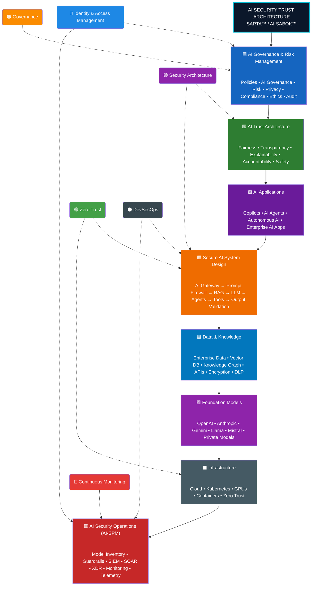
---

## Who SARTA™ Is Designed to Support

***SARTA™ can be adapted to organizations that need to architect, assess, govern, secure, or modernize complex technology and AI environments, including:***

| Entity | Security Assurances |
|------------|---------|
| **Federal Government** | Cybersecurity risk management, security controls, Zero Trust, cloud security, AI governance, assessment, authorization, and continuous monitoring |
| **Healthcare & Regulated Organizations** | Security, privacy, identity, cloud, risk, compliance, and AI governance |
| **Financial Services** | Technology risk, identity, cloud security, Zero Trust, security controls, resilience, and regulatory requirements |
| **State & Local Government** | Cybersecurity modernization, risk management, cloud security, identity, Zero Trust, AI governance, and security assurance |
| **Critical Infrastructure** | Cybersecurity, resilience, IT/OT considerations, identity, dependencies, cloud, and emerging AI environments |
| **Prime Contractors & Technology Partners** | Specialized cybersecurity and AI-security architecture, assessment, engineering, and advisory expertise |
| **Private Enterprise** | Cybersecurity risk, cloud transformation, identity modernization, AI adoption, governance, and security architecture |

### Design Principles

SARTA™ serves as an architectural and methodological foundation that can support multiple ADUROM AI™ consulting engagements:

1. **Secure by Design**
2. **Trust by Default**
3. **Zero Trust Everywhere**
4. **Govern Throughout the AI Lifecycle**
5. **Monitor Continuously**
6. **Improve Through Measured Risk**

---

## ADUROM AI™ Consulting Alignment

The methodology is not itself a certification, regulatory standard, government framework, or compliance program. It is a proprietary ADUROM AI™ approach designed to help organizations integrate security architecture, risk, governance, identity, resilience, controls, assurance, and emerging technology considerations into practical cybersecurity decision-making.

**SARTA™ provides an architectural and security foundation supporting ADUROM AI™ consulting services across cybersecurity, cloud security, Zero Trust, AI security, governance, risk, and security assurance.**

***The methodology can be applied across Critical Infrastructure, Federal Government, State & Local Government, Healthcare, Financial Services, Technology, and Private Enterprise environments.***

```mermaid
flowchart TB

    %% =========================================================
    %% ADUROM AI CORPORATE FOUNDATION
    %% =========================================================

    CORP["🏢 ADUROM AI - CORP<br/><br/>Corporate Entity<br/>Proprietary Technology & Intellectual Property"]

    BRAND["🔷 ADUROM AI™<br/><br/>Cybersecurity • AI Security<br/>Resilience Engineering • Research<br/>Products & Services"]

    CORP --> BRAND

    %% =========================================================
    %% SARTA FAMILY
    %% =========================================================

    SARTA["🛡️ SARTA™<br/><br/>Sovereign Adaptive Resilience<br/>& Trust Architecture™<br/><br/>Proprietary Research & Engineering Framework"]

    V3["⚡ SARTA™ v3™<br/><br/>Advanced Adaptive / Autonomous<br/>Security Architecture Concepts"]

    SABOK["📚 AI-SABOK™<br/><br/>AI Security Body of Knowledge<br/>Knowledge Architecture • Taxonomy<br/>Security Practices"]

    AITORA["🎯 AITORA™<br/><br/>AI Technology / Risk /<br/>Operational Assurance"]

    BRAND --> SARTA

    SARTA --> V3
    SARTA --> SABOK
    SARTA --> AITORA

    %% =========================================================
    %% SARTA CORE DOMAINS
    %% =========================================================

    GOV["🟦 GOVERNANCE<br/><br/>Authority • Accountability<br/>Policy • Risk Ownership"]

    IDENTIFY["🟩 IDENTIFY<br/><br/>Assets • Identities • Data<br/>AI Systems • Dependencies • Risk"]

    ARCH["🟪 ARCHITECT<br/><br/>Security Architecture<br/>Cloud • AI • Identity • Data"]

    PROTECT["🟧 PROTECT<br/><br/>Preventive Safeguards<br/>Security Controls • Hardening"]

    DETECT["🟦 DETECT<br/><br/>Monitoring • Telemetry<br/>Threats • Anomalies • Failures"]

    RESPOND["🟪 RESPOND<br/><br/>Investigation • Containment<br/>Incident Response • Remediation"]

    ASSURE["⬛ ASSURE<br/><br/>Evidence • Validation<br/>Testing • Effectiveness • Risk Decisions"]

    RESILIENCE["🟥 RESILIENCE<br/><br/>Continuity • Recovery<br/>Adaptation • Operational Resilience"]

    SARTA --> GOV
    SARTA --> IDENTIFY
    SARTA --> ARCH
    SARTA --> PROTECT
    SARTA --> DETECT
    SARTA --> RESPOND
    SARTA --> ASSURE
    SARTA --> RESILIENCE

    %% =========================================================
    %% TECHNOLOGY & ENGINEERING DOMAINS
    %% =========================================================

    AISEC["🤖 AI SECURITY<br/><br/>Prompt Security<br/>AI Workload Protection<br/>Model / Agent Security<br/>Input & Output Controls"]

    CLOUD["☁️ CLOUD SECURITY<br/><br/>Sovereign Cloud<br/>Infrastructure Security<br/>Encryption • KMS • Network Security"]

    IAM["🔐 IDENTITY & ACCESS<br/><br/>IAM • RBAC<br/>Least Privilege<br/>Service Identity"]

    ZT["🟢 ZERO TRUST<br/><br/>Identity-Centric Security<br/>Continuous Verification<br/>Micro-Segmentation"]

    K8S["☸️ KUBERNETES SECURITY<br/><br/>Workload Hardening<br/>Pod Security<br/>Container Security"]

    OPA["⚙️ POLICY-AS-CODE<br/><br/>OPA / Rego<br/>Automated Policy Enforcement<br/>Compliance Guardrails"]

    DETENG["🔎 DETECTION ENGINEERING<br/><br/>Falco • Runtime Detection<br/>Threat Detection<br/>Security Telemetry"]

    DEVSEC["🔄 DEVSECOPS<br/><br/>Secure CI/CD<br/>Security Gates<br/>Automated Validation"]

    RESENG["🧬 RESILIENCE ENGINEERING<br/><br/>Chaos Testing<br/>Failure Recovery<br/>RTO • Adaptive Response"]

    EVIDENCE["📊 SECURITY ASSURANCE<br/><br/>Evidence Register<br/>Testing • Measurement<br/>Validation • Demonstration"]

    ARCH --> AISEC
    ARCH --> CLOUD
    IDENTIFY --> IAM
    PROTECT --> ZT
    PROTECT --> K8S
    GOV --> OPA
    DETECT --> DETENG
    PROTECT --> DEVSEC
    RESILIENCE --> RESENG
    ASSURE --> EVIDENCE

    %% =========================================================
    %% SARTA RESEARCH LAB
    %% =========================================================

    LAB["🧪 SARTA™ SOVEREIGN CLOUD SECURITY LAB<br/><br/>Hands-On Research & Engineering Environment<br/><br/>Architecture → Implementation → Testing → Evidence"]

    BRAND --> LAB
    SARTA --> LAB

    LAB --> AISEC
    LAB --> IAM
    LAB --> OPA
    LAB --> CLOUD
    LAB --> K8S
    LAB --> DETENG
    LAB --> DEVSEC
    LAB --> RESENG
    LAB --> EVIDENCE

    %% =========================================================
    %% TECHNICAL IMPLEMENTATION LAYERS
    %% =========================================================

    TERRAFORM["Terraform / Infrastructure as Code<br/><br/>AWS • VPC • KMS<br/>Infrastructure Configuration"]

    KUBE["Kubernetes<br/><br/>Workload Security<br/>Container Controls"]

    REGO["OPA / Rego<br/><br/>Policy-as-Code<br/>Sovereignty Controls"]

    RBAC["Kubernetes RBAC<br/><br/>Least Privilege<br/>Service Account Authorization"]

    FALCO["Falco<br/><br/>Runtime Security<br/>Workload Detection"]

    CICD["Secure CI/CD<br/><br/>Pipeline Security<br/>DevSecOps Controls"]

    PYTHON["Validation Tooling<br/><br/>Policy Testing<br/>Latency / Compliance Checks"]

    AICTRL["AI Security Controls<br/><br/>Semantic Filtering<br/>Prompt-Injection Detection<br/>Workload Isolation"]

    CLOUD --> TERRAFORM
    K8S --> KUBE
    OPA --> REGO
    IAM --> RBAC
    DETENG --> FALCO
    DEVSEC --> CICD
    EVIDENCE --> PYTHON
    AISEC --> AICTRL

    %% =========================================================
    %% EXTERNAL FRAMEWORKS & STANDARDS
    %% =========================================================

    NISTCSF["NIST CSF<br/><br/>Cybersecurity Risk Management"]

    NISTRMF["NIST RMF<br/><br/>Risk Management Framework"]

    NISTAI["NIST AI RMF<br/><br/>AI Risk Management"]

    NIST800["NIST SP 800-53<br/><br/>Security & Privacy Controls"]

    FEDRAMP["FedRAMP<br/><br/>Federal Cloud Security<br/>Authorization Framework"]

    ZTF["Zero Trust Principles<br/><br/>Identity • Verification<br/>Least Privilege"]

    ATTACK["MITRE ATT&CK<br/><br/>Threat Behavior<br/>Adversary Techniques"]

    ATLAS["MITRE ATLAS<br/><br/>AI Threat Landscape<br/>Adversarial AI Techniques"]

    OWASP["OWASP<br/><br/>Application & AI Security<br/>Security Guidance"]

    ISO["ISO / IEC Standards<br/><br/>Security • Privacy<br/>Governance • Risk"]

    REG["Applicable Regulatory &<br/>Organizational Requirements<br/><br/>Context-Specific Mapping"]

    %% =========================================================
    %% FRAMEWORK MAPPING
    %% =========================================================

    SARTA -. "Mapped / Informed By" .-> NISTCSF
    SARTA -. "Mapped / Informed By" .-> NISTRMF
    SARTA -. "Mapped / Informed By" .-> NISTAI
    SARTA -. "Mapped / Informed By" .-> NIST800
    SARTA -. "Mapped / Informed By" .-> FEDRAMP
    SARTA -. "Mapped / Informed By" .-> ZTF
    SARTA -. "Mapped / Informed By" .-> ATTACK
    SARTA -. "Mapped / Informed By" .-> ATLAS
    SARTA -. "Mapped / Informed By" .-> OWASP
    SARTA -. "Mapped / Informed By" .-> ISO
    SARTA -. "Mapped / Informed By" .-> REG

    %% =========================================================
    %% EVIDENCE MATURITY
    %% =========================================================

    E1["E1 — DESIGNED<br/><br/>Architecture / Control Concept"]

    E2["E2 — IMPLEMENTED<br/><br/>Technical Artifact Exists"]

    E3["E3 — TESTED<br/><br/>Controlled Execution & Measurement"]

    E4["E4 — DEMONSTRATED<br/><br/>Integrated Repeatable Demonstration"]

    E5["E5 — OPERATIONAL /<br/>CUSTOMER VALIDATED<br/><br/>Operational or Customer Evidence"]

    EVIDENCE --> E1
    E1 --> E2
    E2 --> E3
    E3 --> E4
    E4 --> E5

    %% =========================================================
    %% COMMERCIAL / FEDERAL APPLICATIONS
    %% =========================================================

    FED["🏛️ FEDERAL APPLICATIONS<br/><br/>Cybersecurity Engineering<br/>AI Security<br/>Cloud Security<br/>Security Architecture<br/>Resilience"]

    COMM["🏢 COMMERCIAL APPLICATIONS<br/><br/>Enterprise AI Security<br/>Cloud Security<br/>Governance & Risk<br/>Security Assurance"]

    SERVICES["🚀 ADUROM AI™ PRODUCTS & SERVICES<br/><br/>Security Engineering<br/>AI Security<br/>Governance • Risk • Assurance<br/>Architecture • Resilience"]

    E4 --> FED
    E4 --> COMM
    E5 --> FED
    E5 --> COMM

    BRAND --> SERVICES
    SARTA --> SERVICES

    %% =========================================================
    %% MASTER SECURITY LIFECYCLE
    %% =========================================================

    LIFECYCLE["🔁 SARTA™ CONNECTED SECURITY LIFECYCLE"]

    GOV --> LIFECYCLE
    IDENTIFY --> LIFECYCLE
    ARCH --> LIFECYCLE
    PROTECT --> LIFECYCLE
    DETECT --> LIFECYCLE
    RESPOND --> LIFECYCLE
    RESILIENCE --> LIFECYCLE
    ASSURE --> LIFECYCLE

    LIFECYCLE --> ARCH

    %% =========================================================
    %% VISUAL STYLING
    %% =========================================================

    style CORP fill:#0B172A,color:#FFFFFF,stroke:#00BCD4,stroke-width:4px
    style BRAND fill:#1565C0,color:#FFFFFF,stroke:#42A5F5,stroke-width:4px

    style SARTA fill:#6A1B9A,color:#FFFFFF,stroke:#E1BEE7,stroke-width:5px
    style V3 fill:#8E24AA,color:#FFFFFF,stroke:#E1BEE7,stroke-width:2px
    style SABOK fill:#4527A0,color:#FFFFFF,stroke:#B39DDB,stroke-width:2px
    style AITORA fill:#5E35B1,color:#FFFFFF,stroke:#D1C4E9,stroke-width:2px

    style GOV fill:#1565C0,color:#FFFFFF
    style IDENTIFY fill:#2E7D32,color:#FFFFFF
    style ARCH fill:#6A1B9A,color:#FFFFFF
    style PROTECT fill:#EF6C00,color:#FFFFFF
    style DETECT fill:#0277BD,color:#FFFFFF
    style RESPOND fill:#8E24AA,color:#FFFFFF
    style ASSURE fill:#37474F,color:#FFFFFF
    style RESILIENCE fill:#C62828,color:#FFFFFF

    style AISEC fill:#4527A0,color:#FFFFFF
    style CLOUD fill:#0277BD,color:#FFFFFF
    style IAM fill:#1E88E5,color:#FFFFFF
    style ZT fill:#43A047,color:#FFFFFF
    style K8S fill:#1565C0,color:#FFFFFF
    style OPA fill:#EF6C00,color:#FFFFFF
    style DETENG fill:#C62828,color:#FFFFFF
    style DEVSEC fill:#37474F,color:#FFFFFF
    style RESENG fill:#AD1457,color:#FFFFFF
    style EVIDENCE fill:#2E7D32,color:#FFFFFF

    style LAB fill:#0B172A,color:#FFFFFF,stroke:#00BCD4,stroke-width:4px

    style TERRAFORM fill:#5C6BC0,color:#FFFFFF
    style KUBE fill:#326CE5,color:#FFFFFF
    style REGO fill:#FF8F00,color:#FFFFFF
    style RBAC fill:#3949AB,color:#FFFFFF
    style FALCO fill:#D32F2F,color:#FFFFFF
    style CICD fill:#455A64,color:#FFFFFF
    style PYTHON fill:#2E7D32,color:#FFFFFF
    style AICTRL fill:#7B1FA2,color:#FFFFFF

    style NISTCSF fill:#607D8B,color:#FFFFFF
    style NISTRMF fill:#607D8B,color:#FFFFFF
    style NISTAI fill:#607D8B,color:#FFFFFF
    style NIST800 fill:#607D8B,color:#FFFFFF
    style FEDRAMP fill:#607D8B,color:#FFFFFF
    style ZTF fill:#607D8B,color:#FFFFFF
    style ATTACK fill:#607D8B,color:#FFFFFF
    style ATLAS fill:#607D8B,color:#FFFFFF
    style OWASP fill:#607D8B,color:#FFFFFF
    style ISO fill:#607D8B,color:#FFFFFF
    style REG fill:#607D8B,color:#FFFFFF

    style E1 fill:#90A4AE,color:#FFFFFF
    style E2 fill:#42A5F5,color:#FFFFFF
    style E3 fill:#66BB6A,color:#FFFFFF
    style E4 fill:#FFA726,color:#FFFFFF
    style E5 fill:#EF5350,color:#FFFFFF

    style FED fill:#263238,color:#FFFFFF,stroke:#90CAF9,stroke-width:2px
    style COMM fill:#263238,color:#FFFFFF,stroke:#A5D6A7,stroke-width:2px
    style SERVICES fill:#B71C1C,color:#FFFFFF,stroke:#EF9A9A,stroke-width:4px

    style LIFECYCLE fill:#0B172A,color:#FFFFFF,stroke:#00E5FF,stroke-width:4px
```
  
---

***ADUROM AI™ is tailored to your organizational mission, regulatory requirements, technology environments, risk tolerance, and operational objectives.***

## ADUROM AI™ Service Offerings

| Offering                                  | Primary Focus                                                                              |
| -------------------------------------- | ------------------------------------------------------------------------------------ |
| 🟩 **CyberGRC-360™**                        | Cybersecurity risk, governance, control assessment, compliance, and security assurance.       |
| 🟧 **ZeroTrust-360™**                         | Zero Trust architecture, IAM, PAM, least privilege, segmentation, and identity modernization.               |
| 🟦 **CloudSecure-360™**                          | Cloud security architecture, risk, identity, workloads, data, and security controls.       |
| ⬛ **AI-Secure™**                          | AI security, secure AI architecture, AI governance, AI risk, threat modeling, and AI security controls.                     |
| 🟥 **AITORA™**                      | AI trust, governance, security, risk, operational readiness, and executive advisory. |

---

## ADAPTIVE

**Adaptive represents the ability of security and governance capabilities to change as threats, technology, missions, architectures, regulations, and organizational risk change.**

***SARTA™ therefore treats cybersecurity and AI security as continuous processes instead of one-time compliance exercises.***

**Adaptive capabilities include:**

1. ***Continuous Risk Assessment***
2. ***Continuous Monitoring***
3. ***Threat-Informed Defense***
4. ***Dynamic Access Decisions***
5. ***Security Telemetry***
6. ***AI Behavioral Monitoring***
7. ***Changing Security Controls as Risk Changes***
8. ***Continuous Improvement***
9. ***Lessons Learned***
10. ***Emerging-Technology Assessment***

---

## RESILIENCE

**Resilience represents the organization's ability to anticipate, withstand, respond to, recover from, and adapt to disruptive cybersecurity, technology, AI, operational, and supply-chain events.**

***SARTA™ resilience encompasses:***

a) **Cyber Resilience**

b) **Cloud Resilience**

c) **AI Resilience**

d) **Operational Resilience**

e) **Data Resilience**

f) **Identity Resilience**

g) **Supply-Chain Resilience**

h) **Disaster Recovery**

i) **Business Continuity**

j) **Incident Response**

k) **Recovery and Restoration**

l) **Adaptive Improvement**

***The objective is not merely to prevent compromise. The objective is to ensure that the organization can continue operating, respond effectively, and recover when prevention fails.***

---

## TRUST

**Trust represents confidence that technology, identities, data, systems, applications, AI models, AI agents, and transactions are appropriately authorized, protected, observable, and governed.**

***SARTA™ treats trust as earned, evaluated, and continuously reassessed instead of permanently assumed.***

### Trust is influenced by:

1. **Identity**
2. **Authentication**
3. **Authorization**
4. **Device/Workload Posture**
5. **Data Sensitivity**
6. **Transaction Context**
7. **Behavioral Signals**
8. **Threat Intelligence**
9. **Security Telemetry**
10. **Policy**
11. **Risk**
12. **Human Oversight**
13. **AI Behavior**

***SARTA™ therefore aligns naturally with Zero Trust principles while remaining an ADUROM AI proprietary methodology.***

---

## AI-SABOK™ AI Security Architect Body of Knowledge™

**Defines the core domains, principles, and best practices required to design, build, secure, deploy, monitor, and govern trustworthy AI solutions throughout their lifecycle.**

***Together, these frameworks provide a structured approach for implementing:***

* 🛡️ AI Governance & Risk Management (aligned with the NIST AI RMF)
* 🤝 AI Trust Architecture
* 🏗️ Secure AI System Design (RAG, Agents, AI Gateways)
* 🔍 AI Threat Modeling & Risk Analysis
* 🔐 AI Identity & Access Management
* 📊 AI Security Posture Management (AI-SPM)
* 🚀 Continuous Monitoring & Operational Resilience

**👤 Created by ADUROM AI™**

**Sole Owner of (SARTA™ / AI-SABOK™ / AITORA™ / SARTA™v3™)**

**Copyright© June 1, 2026 by ADUROM AI™ (All Rights Reserved)**

**Version 1.0**

***Mission Statement:
To establish the definitive, vendor-neutral body of knowledge for AI Security Architects by integrating enterprise architecture, cybersecurity, identity, governance, cloud platforms, AI engineering concepts, and operational best practices into a single, practical reference.***

---

### Architecture Layers

| Layers                                  | Purpose                                                                              |
| -------------------------------------- | ------------------------------------------------------------------------------------ |
| 🟦 **Governance & Risk Management**    | Policies, compliance, ethics, privacy, and enterprise AI governance                  |
| 🟩 **AI Trust Architecture**           | Fairness, transparency, explainability, accountability, safety, and resilience       |
| 🟪 **AI Applications**                 | Copilots, AI assistants, autonomous AI, and enterprise AI applications               |
| 🟧 **Secure AI System Design**         | AI Gateways, Prompt Firewalls, RAG, Agents, MCP, and output validation               |
| 🟦 **Data & Knowledge**                | Enterprise data, vector databases, knowledge graphs, APIs, encryption, and DLP       |
| 🟪 **Foundation Models**               | Public and private LLMs, foundation models, and fine-tuned models                    |
| ⬛ **Infrastructure**                   | Cloud, Kubernetes, GPUs, containers, networking, and Zero Trust                      |
| 🟥 **AI Security Operations (AI-SPM)** | Guardrails, monitoring, telemetry, SIEM, SOAR, XDR, posture management, and auditing |

---

### Cross-Cutting Security Pillars

These capabilities apply across **every layer** of the architecture:

* 🔵 **Identity & Access Management**
* 🟢 **Zero Trust**
* 🟣 **Security Architecture**
* 🟠 **Governance**
* 🔴 **Continuous Monitoring**
* ⚫ **DevSecOps**

---

### 🎯 Core Objectives

* 🧠 Advance research into autonomous security systems
* ☁️ Define sovereign Zero Trust cloud architectures
* 🔐 Model compliance as a continuous computational process
* 🤖 Explore AI-assisted security governance
* 🧩 Demonstrate systems architecture & security engineering at research level

---

### Engineering Domains

* Autonomous Security Systems
* Zero Trust Architecture (Zero Trust Security)
* AI Governance
* Digital Sovereignty
* Cloud Security Engineering
* Distributed Trust Systems
* Continuous Compliance Automation
* Operational Resilience Engineering

---

## ⚙️ Key Capabilities

### 🧠 1. Runtime Intelligence Layer (Sensing & Perception)

### 👁️ Runtime Intelligence

* Kernel-level telemetry
* Behavioral anomaly detection
* Container activity monitoring
* Live attack surface mapping

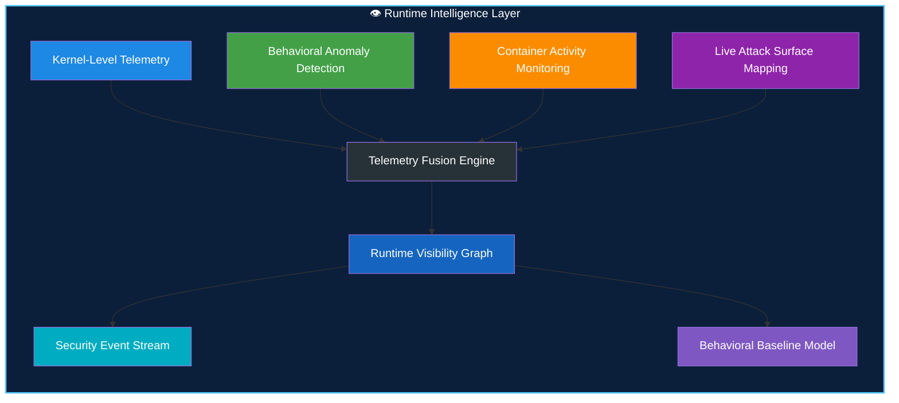

---

### 🛡️ 2. Zero Trust Enforcement Layer (Continuous Verification)

### 🔐 Zero Trust Enforcement

* Continuous workload identity validation
* Mutual authentication
* Policy-driven authorization
* Real-time trust scoring

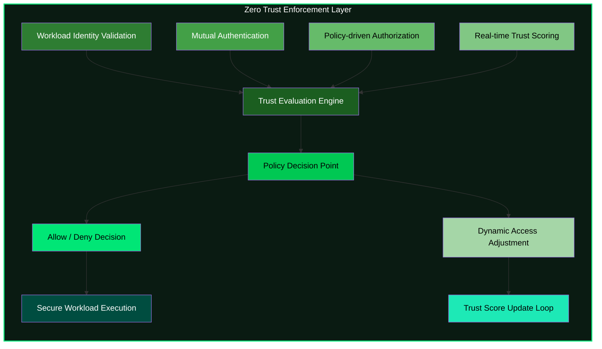

---

### ⚡ 3. Autonomous Response System (Digital Reflex Layer)

### Autonomous Response

* Namespace isolation
* Pod termination
* Traffic throttling
* Node quarantine
* Dynamic policy updates

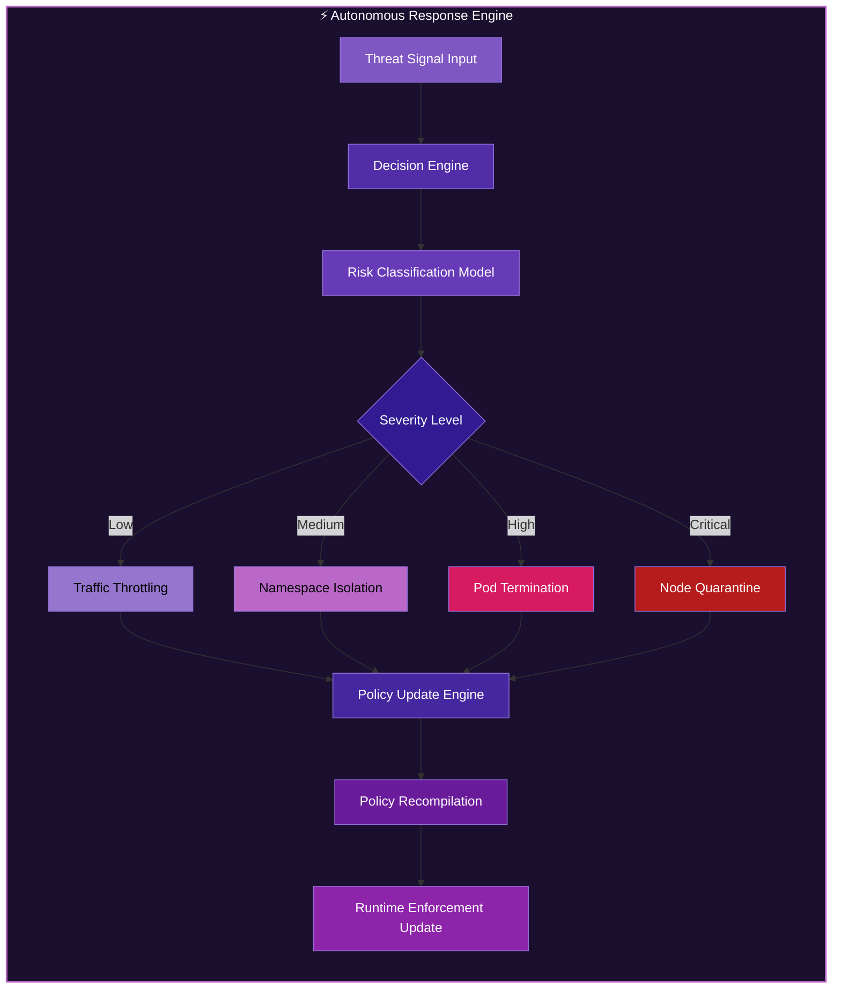

---

### 🌍 4. Sovereign Federation Layer (Distributed Trust System)

### Sovereign Federation

* Cross-domain intelligence sharing
* Regional policy autonomy
* Data locality enforcement
* Federated trust propagation

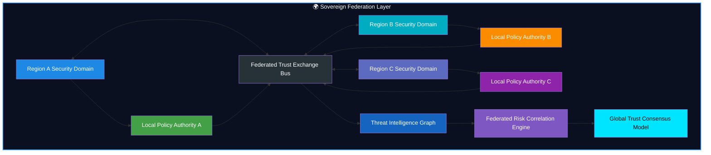

---

### 🧬 Executive Summary

SARTA operationalizes:

* AI-assisted security governance
* Runtime Zero Trust enforcement
* Sovereign multi-cloud control planes
* Federated threat intelligence
* Autonomous incident response
* Policy-as-code enforcement
* Continuous compliance verification
* Digital sovereignty controls

---

### ✨ Master Architecture View (All Layers Combined)

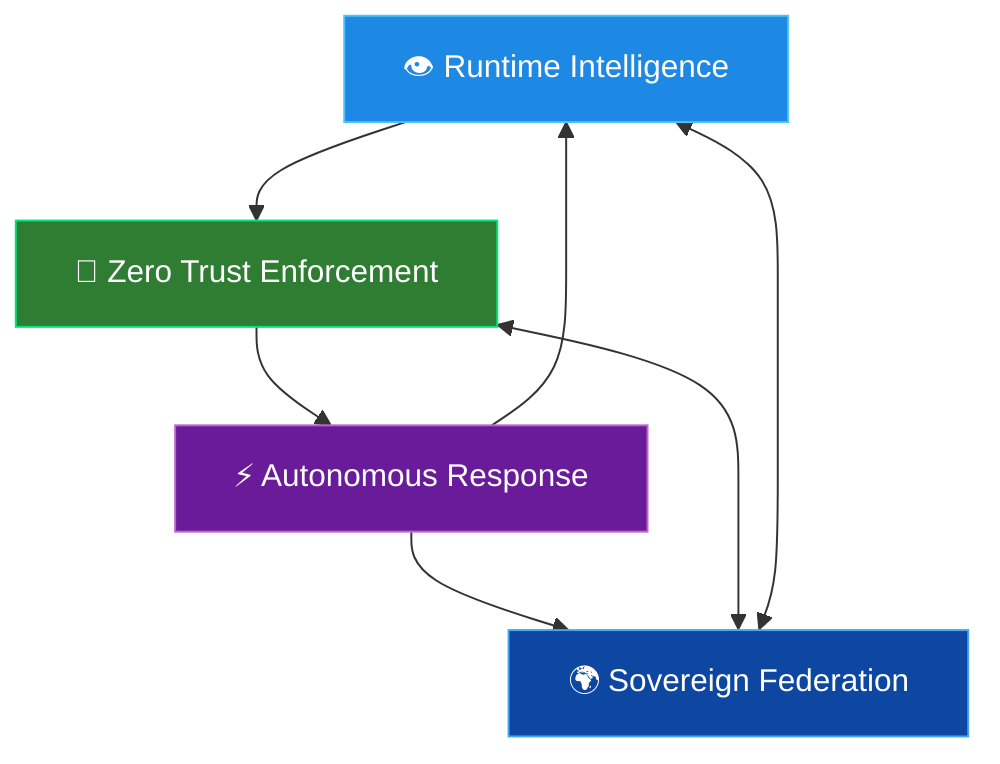

---

## ❓ Why SARTA Exists

Modern security ecosystems are fragmented across:

* SIEM systems
* Identity providers
* Runtime security tools
* Compliance frameworks
* Incident response workflows

### ⚠️ Resulting Problems

* Delayed detection
* Slow response cycles
* Policy inconsistency
* High operational overhead
* Fragmented visibility

SARTA explores whether these can be unified into a **single adaptive computational system**.

---

### 🧪 Research Motivation

Modern infrastructure spans:

* Multi-cloud environments
* Sovereign jurisdictions
* Distributed trust boundaries

Traditional security models remain static and human-driven.

SARTA investigates:

> Can security become a **self-regulating computational organism**?

---

### 🔬 Research Questions

* Can Zero Trust adapt continuously using runtime learning?
* Can compliance become executable code instead of documentation?
* Can sovereign systems share intelligence without losing autonomy?
* What governance is required for AI-driven security decisions?
* Can resilience be continuously verified at runtime?

---

### 🧭 Core Thesis

Security systems should evolve into **digital immune systems**:

* Continuous sensing
* Context-aware reasoning
* Autonomous response
* Policy evolution
* Federated intelligence
* Self-healing behavior

---

### 🧱 Design Principles

* Identity before network trust
* Runtime visibility over assumptions
* Policy as executable logic
* Autonomous response by default
* Human oversight always available
* Sovereignty preserved across domains
* Continuous verification over audits
* Compliance as a runtime property

---

## AITORA™ AI Trust & Operational Readiness Assessment™

**The Market Position:
AITORA™ provides enterprises with a comprehensive, framework-aligned assessment to determine whether AI systems are secure, governed, resilient, and operationally ready for trusted deployment.**

**👤 Created by ADUROM AI™**

**Sole Owner of (SARTA™ / AI-SABOK™ / AITORA™ / SARTA™v3™)**

**Copyright© June 1, 2026 by ADUROM AI™ (All Rights Reserved)**

**Version 1.0**

---

### 🤖 AITORA™ SECURITY ASSESSMENT MODEL

***AI Security represents the protection of AI models, AI applications, AI infrastructure, AI data, AI agents, AI interfaces, AI tools and AI-enabled workflows against security threats and unintended behavior.***

**AITORA™ AI Security Threat Assessments - Address:**

1. AI Threat Modeling
2. Prompt injection
3. Data Leakage
4. Model and Application Security
5. RAG Security
6. AI API Security
7. AI Identity
8. AI Authorization
9. AI Agent Security
10. Tool-Use Security
11. AI Supply-Chain Security
12. AI Monitoring
13. AI Telemetry
14. AI Guardrails
15. Output Validation
16. AI Incident Response
17. AI Resilience

***AI Governance represents the organizational policies, accountability structures, risk-management processes and oversight mechanisms used to govern the responsible, secure and controlled use of AI.***

**AITORA™ AI Security Governance Assessments - Address:**

1. AI Inventory
2. AI Ownership
3. AI Risk Classification
4. Acceptable Use
5. Human Oversight
6. Data Governance
7. Data Privacy
8. Enterprise Security
9. AI Training Model Governance
10. Vendor Governance
11. AI Lifecycle Management
12. Continuous Monitoring
13. Incident Management
14. Accountability
15. Regulatory and Policy Obligations

### Allowed Actions

* Risk scoring
* Threat classification
* Remediation suggestions
* Policy recommendations

### Forbidden Actions

* Overriding trust roots
* Disabling security controls
* Bypassing policy enforcement
* Autonomous identity modification

> All AI actions remain **policy-bound and human-governed**.

---

## 🧬 Digital Immune System Model

<div align="center">


</div>

---

### 🌐 Biological-to-Digital Mapping

| 🧬 Biological System | 🛡️ SARTA Equivalent   | 🎯 Function                                      |
| -------------------- | ---------------------- | ------------------------------------------------ |
| ⚪ White Blood Cells  | Runtime Sensors        | Detect threats and anomalies in real time        |
| 🧠 Brain             | AI Risk Engine         | Analyze, correlate, and prioritize risks         |
| 🧪 Antibodies        | Policy System          | Prevent and neutralize malicious actions         |
| ⚡ Reflex System      | Response Engine        | Execute automated containment and remediation    |
| 🧠💾 Immune Memory   | Threat Knowledge Graph | Learn from previous attacks and improve defenses |

---

### 🧬 Digital Immune Response Cycle

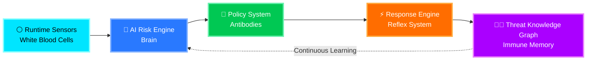

---

### 🩺 Immune System Health Indicators

| Capability               | Status    |
| ------------------------ | --------- |
| 🔍 Threat Detection      | 🟢 Active |
| 🧠 Risk Intelligence     | 🟢 Active |
| 🛡️ Policy Enforcement   | 🟢 Active |
| ⚡ Automated Response     | 🟢 Active |
| 📚 Threat Learning       | 🟢 Active |
| 🔄 Continuous Adaptation | 🟢 Active |

---

## 🎨 Defense Maturity Overview

```text
⚪ Runtime Sensors          🟢🟢🟢🟢🟢 🟢🟢🟢🟢🟢
🧠 AI Risk Engine          🟢🟢🟢🟢🟢 🟢🟢🟢🟢🟢
🧪 Policy System           🟢🟢🟢🟢🟢 🟢🟢🟢🟢🟢
⚡ Response Engine         🟢🟢🟢🟢🟢 🟢🟢🟢🟢⚪
🧠💾 Threat Knowledge      🟢🟢🟢🟢🟢 🟢🟢🟢🟢🟢
```

---

> [!TIP]
> Just as the human immune system continuously detects, analyzes, responds, and learns from biological threats, the **SARTA Digital Immune System** continuously monitors workloads, evaluates risk, enforces policy, orchestrates automated responses, and builds institutional memory from every security event.


## 🧪 Threat Model

### ✅ Defended Against

* Privilege escalation
* Credential misuse
* Lateral movement
* Supply chain compromise
* Policy drift
* Insider threats

### ⚠️ Partially Addressed

* Advanced persistent threats
* Multi-stage intrusion campaigns
* Federated trust abuse

### 🚫 Out of Scope

* Hardware implants
* Firmware-level attacks
* Physical infrastructure compromise

---

### AI-IAM

***AI-IAM — Artificial Intelligence Identity & Access Management — represents the identity, authentication, authorization and privilege-management capabilities required to securely control access by and to AI systems.***

**AI-IAM applies identity principles to:**

* AI applications
* AI models
* AI agents
* AI tools
* AI services
* Machine identities
* Service identities
* Human-to-AI interactions
* Agent-to-agent interactions
* Agent-to-tool interactions
* Agent-to-data interactions

**SARTA™ AI-IAM emphasizes:**

***Identity → Authentication → Authorization → Least Privilege → Context → Monitoring → Revocation. The objective is to ensure that an AI system or agent has only the access necessary to perform its authorized function. AI-IAM is an ADUROM AI conceptual/service domain and is not represented as an official government standard.***

---

### AI-SPM

***AI-SPM — Artificial Intelligence Security Posture Management — represents the continuous identification, assessment, monitoring and improvement of an organization's AI-security posture.***

**SARTA™ AI-SPM may include:**

* AI asset discovery
* AI inventory
* Model inventory
* Agent inventory
* AI application inventory
* AI dependency discovery
* AI configuration assessment
* AI vulnerability identification
* AI risk scoring
* AI policy compliance
* AI data exposure
* AI identity exposure
* AI supply-chain exposure
* AI telemetry
* Continuous monitoring
* Remediation tracking

***AI-SPM is an ADUROM AI conceptual/service domain rather than a government-approved framework or certification.***

---

### AI AGENT SECURITY

***AI Agent Security represents the security of AI systems capable of independently executing tasks, invoking tools, accessing data, interacting with applications, or taking authorized actions.***

**SARTA™ evaluates:**

* Agent identity
* Agent permissions
* Tool permissions
* Data permissions
* API permissions
* Agent-to-agent communication
* Human approval
* Autonomous actions
* Transaction boundaries
* Prompt and instruction security
* Output validation
* Monitoring
* Logging
* Containment
* Emergency disablement

**The central SARTA™ question is:**

***What can the agent see, access, execute, modify, and communicate—and what happens when its behavior becomes unsafe or compromised?***

---

### AI GUARDRAILS

***AI Guardrails represent preventive, detective, and corrective mechanisms designed to constrain AI behavior within authorized security, policy, safety, and operational boundaries.***

**Guardrails may include:**

* Input validation
* Prompt controls
* Content controls
* Data-loss prevention
* Access controls
* Tool restrictions
* Output validation
* Human approval
* Transaction limits
* Policy enforcement
* Monitoring
* Automated containment

***Guardrails are treated as one layer of a broader defense-in-depth architecture and are not assumed to provide complete security by themselves.***

---

### AI TELEMETRY

***AI Telemetry represents the collection and analysis of security-relevant information generated by AI systems and their surrounding infrastructure.***

**Telemetry may include:**

* Prompts
* Responses
* Model activity
* User identity
* Agent identity
* Tool calls
* API calls
* Data access
* Security events
* Policy violations
* Behavioral anomalies
* Configuration changes
* Authentication events

***Telemetry supports monitoring, investigation, detection, assurance, and incident response.***

---

### ASSURANCE

***Assurance represents evidence-based confidence that security, governance, risk and control objectives are appropriately designed, implemented, operating and monitored.***

**SARTA™ assurance includes:**

* Security assessments
* Control assessments
* Evidence validation
* Architecture reviews
* Risk assessments
* Independent verification
* Continuous monitoring
* Remediation validation
* Executive reporting

**Assurance asks:**

***How do we know the organization is actually protected, rather than merely claiming compliance?***

---

### SECURITY CONTROLS

***Control represents a safeguard, process, technology, policy or organizational mechanism designed to reduce risk.***

**SARTA™ recognizes:**

* Preventive controls
* Detective controls
* Corrective controls
* Administrative controls
* Technical controls
* Physical controls
* Compensating controls
* AI-specific controls

***Controls should be evaluated for both design effectiveness and operating effectiveness, where applicable.***

---

### EVIDENCE

***Evidence represents objective information demonstrating the design, implementation, operation or effectiveness of a security, governance or risk-management capability.***

**Examples include:**

* Policies
* Procedures
* Configurations
* Logs
* Tickets
* System documentation
* Architecture diagrams
* Access records
* Assessment results
* Monitoring records
* Test results
* Interviews
* Technical artifacts

***SARTA™ emphasizes evidence-based assessment rather than documentation-only compliance.***

---

### CONTINUOUS MONITORING

***Continuous Monitoring represents the ongoing observation, analysis, and reassessment of security, technology, AI, and risk conditions.***

**It may include:**

* Security telemetry
* Vulnerability monitoring
* Configuration monitoring
* Identity monitoring
* Cloud monitoring
* AI monitoring
* Threat intelligence
* Control monitoring
* Risk reassessment
* Remediation tracking

---

### 🔄 Continuous Security Loop

```mermaid
flowchart LR

%% =========================
%% CORE LOOP
%% =========================

A[Runtime Telemetry<br/>Kernel + Workload Signals] --> 
B[Risk Engine<br/>Behavioral + Threat Scoring]

B --> 
C[Policy Decision Layer<br/>Policy-as-Code Evaluation]

C --> 
D[Autonomous Response Engine<br/>Mitigation & Containment]

D --> 
E[Identity & Trust Re-evaluation<br/>Continuous Verification]

E --> 
F[Federated Intelligence Sharing<br/>Cross-Domain Threat Learning]

F --> 
B

%% =========================
%% VISUAL STYLING
%% =========================

classDef telemetry fill:#1e88e5,color:#ffffff,stroke:#90caf9,stroke-width:1px;
classDef risk fill:#6a1b9a,color:#ffffff,stroke:#ce93d8,stroke-width:1px;
classDef policy fill:#2e7d32,color:#ffffff,stroke:#a5d6a7,stroke-width:1px;
classDef response fill:#d32f2f,color:#ffffff,stroke:#ef9a9a,stroke-width:1px;
classDef identity fill:#00897b,color:#ffffff,stroke:#80cbc4,stroke-width:1px;
classDef federation fill:#1565c0,color:#ffffff,stroke:#64b5f6,stroke-width:1px;

class A telemetry;
class B risk;
class C policy;
class D response;
class E identity;
class F federation;

%% =========================
%% FLOW EMPHASIS
%% =========================

linkStyle default stroke:#90a4ae,stroke-width:2px;
```

---

### 🚀 Autonomous Cyber Defense Architecture

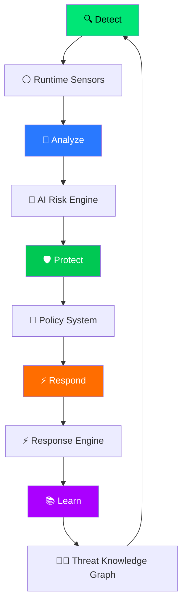

---

## 🧠 Core Idea: Autonomous Security Mesh (v3)

SARTA introduces a shift from fragmented tooling to a unified **Autonomous Security Mesh**:

**👤 Created by ADUROM AI™**

**Sole Owner of (SARTA™ / AI-SABOK™ / AITORA™ / SARTA™v3™)**

**Copyright© June 1, 2026 by ADUROM AI (All Rights Reserved)**

**Version 1.0**

***SARTA™ incorporates emerging AI-security concepts including:***

* AI Security
* AI Governance
* AI-IAM — AI Identity & Access Management
* AI-SPM — AI Security Posture Management
* Agentic AI Security
* RAG Security
* AI Guardrails
* AI Telemetry
* AI Supply-Chain Security
* AI Threat Modeling
* AI Security Assurance

***Important Disclaimer: These relationships represent ADUROM AI's methodology for organizing and applying applicable requirements. They should not be interpreted as official government endorsement or official crosswalks unless specifically identified as such.***

---

## SARTA™v3™ Sovereign Adaptive Resilience & Trust Architecture™

* ☁️ Sovereign Cloud Workloads
* ⚪ Runtime Intelligence
* 🔐 Zero Trust Identity
* 📜 Policy-as-Code Governance
* 📊 Observability & Threat Graph
* 🧠 AI Risk Intelligence
* ⚡ Autonomous Response
* 🛡️ Continuous Compliance
* 🌍 Sovereign Federation
* 👨‍⚖️ Human Governance

### Detect → Verify → Govern → Observe → Analyze → Respond → Comply → Federate → Learn → Adapt
---


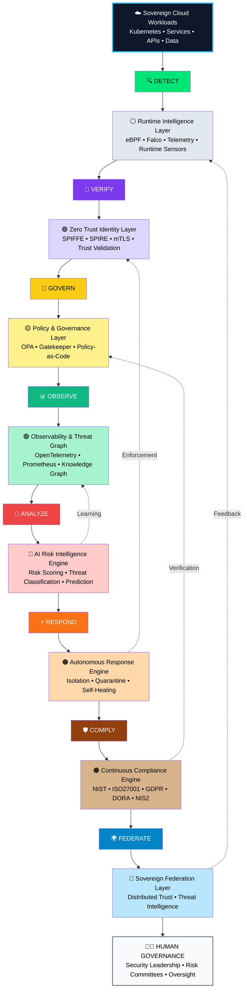

---

## 🏗️ System Architecture (v3 Autonomous Mesh)

### 🧩 Layered Model

* Identity Layer
* Policy Engine
* Runtime Security Layer
* Autonomy Engine
* Threat Graph
* Observability Layer
* Federation Layer

---

### 🧠 Technology Stack

<div align="center">


</div>

---

### 🏗️ Platform Architecture

| 🏢 Layer | 🚀 Technologies | 🎯 Purpose |
|----------|----------------|------------|
| ⚙️ Runtime | Kubernetes • eBPF • Falco | Secure cloud-native workload execution |
| 🔐 Identity | SPIFFE • SPIRE | Zero Trust workload identity |
| 📜 Policy | Open Policy Agent (OPA) • Gatekeeper | Policy-as-Code & governance |
| 📊 Observability | OpenTelemetry • Prometheus | Monitoring, telemetry & visibility |
| 🤖 Intelligence | AI Risk Scoring Engine | Threat prediction & risk analysis |
| 🛡️ Compliance | Continuous Verification System | Automated compliance assurance |

---

### 📐 Security Architecture

<div align="center">


</div>

---

### 🏗️ Layered Security Platform

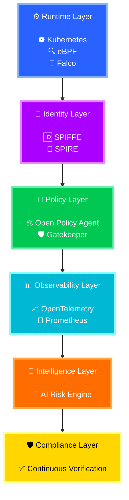

---

### 🌈 Capability Flow

```text
⚙️ Runtime Security
        │
        ▼
🔐 Zero Trust Identity
        │
        ▼
📜 Policy Enforcement
        │
        ▼
📊 Telemetry & Visibility
        │
        ▼
🤖 AI Risk Intelligence
        │
        ▼
🛡️ Continuous Compliance
```

---

### 🎯 Security Capability Matrix

| Layer            | Mission                   | Status    |
| ---------------- | ------------------------- | --------- |
| ⚙️ Runtime       | Workload Protection       | 🟢 Active |
| 🔐 Identity      | Zero Trust Authentication | 🟢 Active |
| 📜 Policy        | Governance & Enforcement  | 🟢 Active |
| 📊 Observability | Telemetry & Monitoring    | 🟢 Active |
| 🤖 Intelligence  | AI Risk Analysis          | 🟢 Active |
| 🛡️ Compliance   | Continuous Assurance      | 🟢 Active |

---

### 🚀 Security Operating Model


> [!IMPORTANT]
> This architecture implements a **Zero Trust, AI-Driven Digital Immune System** where every workload is authenticated, every action is authorized, every event is observed, every risk is analyzed, and every control is continuously verified for compliance.

---

### 🎯 Capability Mapping

| Capability | Status |
|------------|---------|
| 🔐 Zero Trust Identity | 🟢 Enabled |
| ☁️ Cloud Native Security | 🟢 Enabled |
| 📜 Policy as Code | 🟢 Enabled |
| 📊 Real-Time Monitoring | 🟢 Enabled |
| 🤖 AI-Powered Risk Analysis | 🟢 Enabled |
| 🛡️ Continuous Compliance | 🟢 Enabled |
| 🚨 Threat Detection | 🟢 Enabled |
| 🔍 Audit Readiness | 🟢 Enabled |

---

> [!TIP]
> This architecture combines **Zero Trust**, **Cloud Native Security**, **Policy-as-Code**, **Observability**, **AI-Driven Risk Analytics**, and **Continuous Compliance** into a unified security platform.

---

 ## 🧾 Citation

```
@misc{aduromai_sarta_2026,
  title        = {Sovereign Adaptive Resilience and Trust Architecture},
  author       = {{ADUROM AI}},
  year         = {2026},
  date         = {2026-06-01},
  version      = {v3},
  note         = {Proprietary ADUROM AI architecture and methodology}
}
```

---

 # 🌐 SARTA™ Global Framework Relationship Matrix

**ADUROM AI Research Notice**
>
>  This section documents ADUROM AI's research-based relationships between SARTA™ concepts and selected cybersecurity, privacy, cloud, resilience, governance, and compliance frameworks.
>
>  These relationships represent ADUROM AI's architectural interpretation and are **not official crosswalks, certifications, accreditations, authorizations, endorsements, or compliance determinations** issued by the organizations that publish or administer the referenced frameworks, standards, regulations, or programs.
>
>  Organizations remain responsible for determining and demonstrating their own compliance with applicable laws, regulations, contractual requirements, security standards, authorization requirements, and organizational policies.
 
---

 # 📌 Relationship Rating Legend to SARTA™

| Rating | Meaning |
|------------|---------|
| 🟣 Very High | Strong conceptual, architectural, or control-domain relationship |
| 🟢 High | Significant relationship or complementary coverage |
| 🟡 Medium | Partial, contextual, or domain-specific relationship |
| 🔴 Low | Limited direct relationship |
| ⚪ N/A | Not directly applicable or not evaluated |

**Important: Relationship ratings are ADUROM AI research assessments. They do not represent official ratings or compliance determinations by the originating organizations.**

---

## 🇺🇸 United States

### 🔵 NIST Cybersecurity Framework (CSF) 2.0

| Framework / Standard | Relationship |
|------------|---------|
| NIST SP 800-207 | 🟢 High |
| ISO/IEC 27001 | 🟢 High |
| GDPR | 🟡 Medium |
| DORA | 🟡 Medium |
| NIS2 | 🟡 Medium |
| PCI DSS | 🟡 Medium |

 ### Key Areas

- 🏛️ Governance
- 🎯 Cybersecurity Risk Management
- 🔐 Identity & Access Management
- 🚨 Incident Response
- 🔗 Supply Chain Security
- 📈 Continuous Monitoring
- ♻️ Resilience
- 🔎 Detection & Response

---

### 🔷 NIST SP 800-53 Rev. 5

***NIST SP 800-53 provides a comprehensive catalog of security and privacy controls that can serve as an important reference for SARTA™ control-oriented architecture, assessment, assurance, and risk-management activities.***

| Framework / Standard | Relationship |
|------------|---------|
| NIST SP 800-207 | 🟢 High |
| ISO/IEC 27001 | 🟢 High |
| GDPR | 🟢 High |
| DORA | 🟢 High |
| NIS2 | 🟢 High |
| PCI DSS | 🟢 High |

 ### Key Areas

- 🔒 Access Control
- 📝 Audit & Accountability
- 🔑 Cryptographic Protection
- 👤 Privacy
- 🛡️ System & Communications Protection
- 🔎 Continuous Monitoring
- ♻️ Contingency Planning & Recovery

---

### 🟦 NIST Risk Management Framework (RMF)

| RMF Area | SARTA™ Relationship |
|------------|---------|
| Prepare | 🟢 High |
| Categorize | 🟢 High |
| Select | 🟢 High |
| Implement | 🟢 High |
| Assess | 🟣 Very High |
| Authorize | 🟢 High |
| Monitor | 🟣 Very High |

 ### Key Areas

- 🎯 Risk Management
- 🏛️ Governance
- 🔐 Security Controls
- 📋 Assessment
- 📝 Authorization Support
- 📈 Continuous Monitoring

***SARTA™ is not a replacement for the NIST RMF or any federal authorization process. It is positioned as an ADUROM AI proprietary architecture and methodology that can be mapped to RMF activities.***

---

### 🟦 NIST AI Risk Management Framework (AI RMF)

| AI RMF Area | SARTA™ Relationship |
|------------|---------|
| Govern | 🟣 Very High |
| Map | 🟣 Very High |
| Measure | 🟣 Very High |
| Manage | 🟣 Very High |

 ### Key Areas

- 🤖 AI Governance
- 🎯 AI Risk Management
- 🔐 AI Security
- 👤 AI Identity
- 📊 AI Monitoring
- 🛡️ AI Assurance
- ♻️ AI Resilience

 ***SARTA™ extends these concepts architecturally into areas including AI security architecture, AI-IAM, AI-SPM, agentic AI security, RAG security, AI telemetry, guardrails, and AI operational readiness.***

---

 ### 🟦 NIST Generative AI Profile

 ### Key Relationship Areas

- 🤖 Generative AI Risk
- 🔐 AI Security
- 📊 AI Evaluation
- 🛡️ AI Guardrails
- 📁 Data Protection
- 👤 Identity & Access
- 🔎 Monitoring
- 🚨 Incident Management

---

 ### 🟦 NIST SP 800-207 — Zero Trust Architecture

| Domain | Relationship |
|------------|---------|
| Identity | 🟣 Very High |
| Devices | 🟢 High |
| Networks | 🟢 High |
| Applications & Workloads | 🟣 Very High |
| Data | 🟣 Very High |
| Visibility & Analytics | 🟣 Very High |
| Automation & Orchestration | 🟣 Very High |

### Key Areas

- 🔐 Identity-Centric Security
- 🧑‍💻 Least Privilege
- 🔄 Continuous Verification
- 📊 Telemetry
- 🛡️ Policy Enforcement
- 🤖 Automation
- 🧩 Workload Security

---

 ### 🟦 CISA Zero Trust Maturity Model

| Area | Relationship |
|------------|---------|
| NIST SP 800-207 | 🟣 Very High |
| ISO/IEC 27001 | 🟡 Medium |
| GDPR | 🟡 Medium |
| DORA | 🟡 Medium |
| NIS2 | 🟡 Medium |
| PCI DSS | 🟡 Medium |

 ### Core Domains

- 👤 Identity
- 💻 Devices
- 🌐 Networks
- 📦 Applications & Workloads
- 📁 Data
- 📊 Visibility & Analytics
- 🤖 Automation & Orchestration

---

 ### ☁️ FedRAMP

 ### Primary Relationship Areas

- ☁️ Cloud Security
- 🔐 Security Controls
- 🎯 Risk Management
- 📝 Security Assessment
- 🏛️ Authorization Support
- 📈 Continuous Monitoring
- 📊 Security Evidence

**FedRAMP Positioning**

***ADUROM AI positions SARTA™ as a proprietary architecture and methodology that can help organize, assess, document, and relate cloud-security activities to applicable federal security and risk-management requirements, including FedRAMP-related requirements where appropriate.***

---

## 🇨🇦 Canada

| Area | Relationship |
|------------|---------|
| Security Controls | 🟢 High |
| Risk Management | 🟢 High |
| Assessment | 🟢 High |
| Continuous Monitoring | 🟢 High |
| Government Security Baselines | 🟢 High |

 ### Focus Areas

- 🔐 Security Controls
- 🎯 Risk Management
- 🔄 Continuous Assessment
- 🏛️ Government Security Baselines
- 📈 Monitoring
- ☁️ Cloud Security
- 🏛️ Government Workloads
- 📂 Data Classification
- 🔐 Identity & Access
- 🛡️ Secure Operations
- 📊 Security Monitoring
- 👤 Privacy Management
- 🔒 Personal Information Protection
- ✅ Accountability
- 🚨 Breach Management
- 🌐 Data Handling

---

 ## 🇪🇺 European Union

 ### 🟦 EUCS

 ### Focus Areas

- ☁️ Cloud Security
- 🏆 Cloud Assurance
- 🎯 Risk Management
- 🔐 Security Controls
- 📊 Security Monitoring

---

 ## 🟨 eIDAS 2.0

 ### Focus Areas

- 🆔 Digital Identity
- 🔑 Authentication
- 🤝 Trust Services
- 📜 Electronic Identification
- 🔐 Identity Assurance

---

## 🟪 EBA ICT & Security Guidance

 ***EBA ICT and security guidance provides important context for ICT risk management, information security, outsourcing, third-party risk, and operational resilience in the financial sector.***

 ### Focus Areas

- 📡 ICT Risk Management
- 🔗 Outsourcing & Third-Party Risk
- ♻️ Operational Resilience
- 🔐 Information Security
- 📊 Monitoring

---

## 🟦 ENISA Cybersecurity Guidance

### Relationship Areas

| Area | Relationship |
|------------|---------|
| NIS2 | 🟣 Very High |
| DORA | 🟢 High |
| ISO/IEC 27001 | 🟢 High |
| Cloud Security | 🟢 High |
| Cyber Resilience | 🟢 High |

---

## 🇬🇧 United Kingdom

### 🔷 NCSC Cyber Assessment Framework (CAF)

### Security Outcomes

- 🎯 Managing Security Risk
- 🛡️ Protecting Against Cyber Attack
- 🔎 Detecting Cyber Security Events
- 🚨 Minimizing the Impact of Incidents
- ♻️ Recovery

---

## 🟢 Cyber Essentials Plus

### Core Security Areas

- 🔑 Authentication & Access Control
- 🔄 Security Updates
- ⚙️ Secure Configuration
- 🦠 Malware Protection
- 🌐 Network Security

---

 ## 🔵 UK GDPR

 ### Primary Focus

- 👤 Data Privacy
- 🔒 Personal Data Protection
- 📜 Data Governance
- 🚨 Breach Management
- 🌍 Data Transfers

---

## 🌍 Middle East

## 🇦🇪 United Arab Emirates

### 🌟 UAE Information Assurance Standards (IAS)

| Security Domain | Relationship |
|------------|---------|
| 🟦 Security Governance | 🟢 High |
| 🟪 Risk Management | 🟢 High |
| 🟨 Compliance | 🟢 High |
| 🟥 Operational Security | 🟢 High |

---

## 🇦🇪 UAE PDPL

### Focus Areas

- 👤 Privacy Protection
- 🔐 Data Governance
- 🌐 Cross-Border Data Considerations
- 📜 Data Processing
- 🛡️ Data Protection

---

## 🇸🇦 Saudi Arabia

### Essential Cybersecurity Controls (ECC)

### Key Areas

- 🔐 Cybersecurity Governance
- 🎯 Risk Management
- 🏢 Organizational Security
- 📡 Operational Security
- 🔎 Monitoring
- 🚨 Incident Management

---

## Cloud Cybersecurity Controls (CCC)

### Key Areas

- ☁️ Cloud Security
- 🔒 Data Protection
- 🔑 Identity Management
- 🛡️ Security Architecture
- 📈 Monitoring
- 🎯 Risk Management

---

## 🌏 Asia-Pacific

## 🇸🇬 Singapore

## Critical Information Infrastructure Cybersecurity Requirements

| Domain | Relationship |
|------------|---------|
| Operational Resilience | 🟢 High |
| Cybersecurity Risk | 🟢 High |
| ISO/IEC 27001 | 🟢 High |
| Incident Management | 🟢 High |
| Critical Infrastructure Protection | 🟢 High |

---

## 🇯🇵 Japan

### Cybersecurity Management Guidelines

### Key Areas

- 🏛️ Governance
- 🎯 Risk Management
- 🔐 Security Controls
- 📈 Continuous Improvement
- 🔗 Supply Chain Security
- 🚨 Incident Response

---

## 🇦🇺 Australia

### 🚀 Essential Eight

| Security Control | Relationship |
|------------|---------|
| 🟦 Application Control | 🟢 High |
| 🟪 Patch Applications | 🟢 High |
| 🟨 Multi-Factor Authentication | 🟢 High |
| 🟥 Privileged Access Management | 🟢 High |
| 🟩 Backup & Recovery | 🟢 High |

---

## 📊 Global Framework Relationship Summary

| Framework / Standard | Zero Trust | ISO/IEC 27001 | GDPR | DORA | NIS2 | PCI DSS |
| ------------- | -------------  | ------------- | ------------- | ------------- | ------------- | -------------  |
| NIST CSF 2.0 | 🟢 | 🟢 | 🟡 | 🟡 | 🟡 | 🟡 |
| NIST SP 800-53 | 🟢 | 🟢 | 🟢 | 🟢 | 🟢 | 🟢 |
| CISA ZTMM | 🟣 | 🟡 | 🟡 | 🟡 | 🟡 | 🟡 |
| ITSG-33 | 🟢 | 🟢 | 🟡 | 🟡 | 🟡 | 🟡 |
| UK CAF | 🟡 | 🟢 | 🟡 | 🟡 | 🟢 | 🟡 |
| Saudi ECC | 🟡 | 🟢 | 🟡 | 🟡 | 🟡 | 🟡 |
| UAE IAS | 🟡 | 🟢 | 🟡 | 🟡 | 🟡 | 🟡 |
| Singapore CII | 🟡 | 🟢 | 🟡 | 🟡 | 🟡 | 🟡 |
| Australian Essential Eight | 🟡 | 🟢 | 🟡 | 🟡 | 🟡 | 🟡 |
| PCI DSS 4.0 | 🟡 | 🟢 | 🟡 | 🟡 | 🟡 | 🟣 |

***Interpretation: This table represents ADUROM AI's high-level research assessment of conceptual and control-domain relationships. It does not establish regulatory compliance, certification, authorization, accreditation, or legal conformity.***

---

## 🤖 SARTA™ AI Security Extension

**SARTA™ research extends the broader security architecture into emerging AI-security domains, including:**

- AI Governance
- AI Risk Management
- AI Security Architecture
- AI Threat Modeling
- AI Identity & Access Management (AI-IAM)
- AI Security Posture Management (AI-SPM)
- Agentic AI Security
- AI Agent Governance
- Retrieval-Augmented Generation (RAG) Security
- AI Guardrails
- AI Gateways
- Prompt Security
- Output Validation
- AI Data Loss Prevention
- AI Telemetry
- AI Supply-Chain Security
- AI Runtime Security
- AI Security Assurance
- AI Operational Readiness

 > These capabilities represent ADUROM AI research and methodology development. They should not be interpreted as government-approved controls, certifications, or independently validated commercial products unless explicitly identified as such.

---

## 📈 Example Security, AI & Resilience Metrics

- Mean Time to Detect (MTTD)
- Mean Time to Respond (MTTR)
- Policy Drift Rate
- False Positive Rate
- Control Coverage
- Compliance Evidence Coverage
- Identity Verification Success Rate
- Privileged Access Exceptions
- Vulnerability Remediation Time
- Security Telemetry Coverage
- AI Control Coverage
- AI Policy Exceptions
- AI Model / Agent Inventory Coverage
- AI Identity & Authorization Coverage
- AI Data Protection Coverage
- Recovery Time Objective (RTO)
- Recovery Point Objective (RPO)

---

## ⚔️ Example Adaptive Security Response Flow

```
1. Suspicious workload executes
2. Runtime telemetry detects anomalous behavior
3. Risk engine evaluates activity
4. Policy engine evaluates applicable controls
5. Response mechanism applies appropriate containment
6. Identity trust is reevaluated
7. Security intelligence is correlated
8. Applicable policies and controls are reviewed
9. Incident and remediation evidence is retained
10. Lessons learned feed continuous improvement
```

***Research Model Notice: This represents a conceptual SARTA™ adaptive-security model. Actual implementation behavior depends on the technologies, policies, architectures, authorization boundaries, and operational processes used by the implementing organization.***

---

## 🧭 Architecture Decision Records (ADR)

Architecture Decision Records are maintained in:

```
docs/adr/
```

 Each ADR should document:

 - Context
- Problem or decision
- Options considered
- Decision
- Security implications
- Operational implications
- Alternatives considered
- Consequences
- Validation criteria
- Review requirements

---

## 🔬 Research Contributions
 
 Current ADUROM AI™ research areas include:

- Adaptive Security Control Models
- Sovereign Cloud Security Architecture
- Continuous Compliance Architecture
- AI Governance for Security Operations
- AI Security Architecture
- AI Identity & Access Management
- AI Security Posture Management
- Agentic AI Security
- Federated Trust Models
- Cyber Resilience
- Digital Immune System Concepts
- AI Security Assurance
- AI Operational Readiness

***Research Status: These areas represent ADUROM AI research and development. Individual concepts should not be interpreted as validated commercial products, government-approved architectures, certifications, or production-ready security controls unless explicitly identified as such.***

---

## 🗺️ Research Roadmap

- **Phase 1** — Reference Architecture
- **Phase 2** — Prototype Validation
- **Phase 3** — Adaptive Policy Systems
- **Phase 4** — Sovereign Federation Experiments
- **Phase 5** — AI Governance Validation
- **Phase 6** — Large-Scale Operational Testing
- **Phase 7** — AITORA™ Assessment Methodology Development
- **Phase 8** — AI Security Assurance & Readiness Research
- **Phase 9** — Enterprise and Federal Use-Case Validation

---

## 🚀 Reproducing the Technical Laboratory

### Requirements

- Kubernetes v1.25+
- Linux kernel 5.x+ with eBPF support
- Open Policy Agent
- Falco
- SPIRE

### Deployment

```
kubectl apply -f control-plane/manifests/
kubectl apply -f identity-layer/manifests/
helm install falco runtime-security/helm/falco
kubectl apply -f autonomy-engine/manifests/
make demo-run
```

***Implementation Notice: Commands, paths, versions, dependencies, and deployment procedures should be verified against the current repository implementation before being represented as tested or production-ready procedures.***

---

## 🤝 Contribution & Governance

The research repository follows a security-focused development approach that may include:

- Trunk-based development
- Security-focused code review
- Policy change approval
- Architecture review gates
- Severity-based issue triage
- Documentation review
- Security testing
- Research validation
- Change management

---

## 📚 Publications

 Research papers, technical papers, white papers, and drafts are maintained in:

```
docs/publications/
```

Where applicable, publications should identify whether they represent:

- Research
- Experimental work
- Reference architecture
- Prototype
- Draft methodology
- Validated implementation
- Commercial methodology

---

## Intellectual Property & Framework Disclaimer

### ADUROM AI™ Proprietary Intellectual Property

**© June 1, 2026 ADUROM AI CORP. All Rights Reserved.**

* ADUROM AI™ is the proprietary market-facing brand of ADUROM AI - CORP, subject to applicable trademark rights, registrations, third-party rights, and written agreements.

* ADUROM AI™ encompasses the intellectual property, proprietary methodologies, frameworks, architectures, research, engineering assets, products, services, documentation, technical materials, and associated brand assets developed, owned, or lawfully controlled by ADUROM AI - CORP.

### The ADUROM AI™ intellectual-property portfolio includes, but is not limited to:

* ADUROM AI™ — corporate and market-facing brand

* SARTA™ — Sovereign Adaptive Resilience & Trust Architecture™

* SARTA™ v3™

* AI-SABOK™

* AITORA™

* SARTA™ methodologies

* SARTA™ architectures

* SARTA™ security and resilience models

* SARTA™ technical implementation patterns

* SARTA™ technical artifacts

* SARTA™ evidence and assurance methodologies

* ADUROM AI™ research and engineering materials

* ADUROM AI™ products and services

**Associated terminology, taxonomies, models, diagrams, documentation, designs, software, source code, and original technical works**

***Unless expressly identified otherwise, these materials are proprietary to ADUROM AI - CORP and are protected by applicable intellectual-property rights.***

---

### ADUROM AI™ Ownership and Brand Relationship

**The relationship among the principal ADUROM AI™ assets is represented conceptually as follows:**

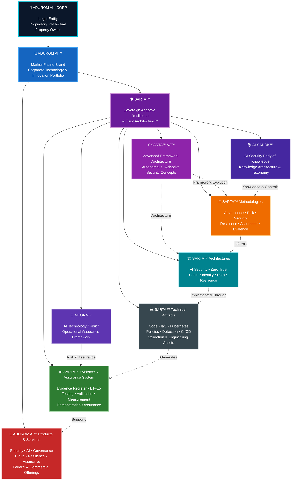

### The above structure identifies the intended relationship between the ADUROM AI™ brand and its associated proprietary frameworks, methodologies, technical assets, products, and services.

* Nothing in this repository transfers ownership of these assets to any individual, organization, customer, partner, contractor, or third party.

---

### SARTA™ Framework Status

* SARTA™ is an ADUROM AI™ proprietary research and engineering framework.

* SARTA™ may be mapped to or informed by established government, regulatory, and industry frameworks and standards. Such references do not imply ownership, endorsement, certification, accreditation, authorization, or official affiliation with the organizations responsible for those frameworks or standards.

* SARTA™ is not a U.S. Government framework, certification, accreditation, authorization, regulation, or compliance standard.

* SARTA™ does not replace or supersede applicable laws, regulations, agency requirements, contractual requirements, NIST publications, FedRAMP requirements, or other authoritative standards and guidance.

---

### Proprietary Use Restrictions

* The contents of this repository may include proprietary ADUROM AI™ intellectual property.

**Unless expressly authorized by ADUROM AI - CORP in writing or expressly permitted by an applicable third-party license, no rights are granted to: reproduce ADUROM AI™ proprietary materials for commercial purposes;** 

* copy, modify, adapt, or create derivative commercial works from proprietary ADUROM AI™ or SARTA™ materials;
* redistribute proprietary ADUROM AI™ framework materials;
* commercially exploit proprietary ADUROM AI™ methodologies, architectures, models, documentation, or technical materials;
* remove or alter proprietary notices; represent ADUROM AI™, SARTA™, AI-SABOK™, AITORA™, or associated methodologies as the property or work of another organization;
* use ADUROM AI™ or associated marks in a manner suggesting sponsorship, endorsement, certification, authorization, partnership, or ownership where none exists;
* or imply that publication of repository materials constitutes a license or transfer of intellectual-property rights.

**Public availability of this repository does not, by itself, constitute a commercial license or assignment of ADUROM AI™ intellectual property.**

---

### Copyright

* Original documentation, source code, architecture descriptions, diagrams, technical materials, research materials, and other copyrightable works contained in this repository are protected by applicable copyright law, subject to applicable third-party rights and licenses.

**Copyright © June 1, 2026 by ADUROM AI - CORP. All Rights Reserved.**

* Where a specific repository file contains a separate copyright, license, or attribution notice, that notice applies to the applicable material.

---

### Trademarks and Brand Identity

***The following names are used as ADUROM AI™ proprietary or claimed marks, subject to applicable trademark rights and registration status:***

* ADUROM AI™

* SARTA™

* SARTA™ v3™

* AI-SABOK™

* AITORA™

**The ™ designation indicates a claimed trademark and does not represent a statement that federal trademark registration has been granted.**

**The ® symbol will be used only where applicable to federally registered marks and the associated goods or services covered by the registration.**

**Third parties may not use ADUROM AI™ marks in a manner that creates a likelihood of confusion regarding source, sponsorship, affiliation, authorization, certification, or endorsement.**

---

### Confidential and Non-Public Information

* Nothing in this repository should be interpreted as authorizing the disclosure of confidential or non-public ADUROM AI™ information.

* Proprietary information that is intentionally maintained as confidential may be subject to additional protections and should not be disclosed publicly merely because related research or implementation materials are available in this repository.

* Do not submit passwords, API keys, credentials, private certificates, customer information, controlled information, confidential information, or other non-public sensitive materials to this repository.

---

### Third-Party Materials

* This repository may reference or incorporate third-party technologies, open-source software, standards, specifications, documentation, trademarks, or other materials.

* Third-party materials remain the property of their respective owners and are subject to their applicable licenses, terms, and intellectual-property rights.

* Nothing in this notice is intended to restrict rights granted under an applicable third-party license.

---

### LIONSIGHT Relationship

* LIONSIGHT is an independent strategic and federal-contracting partner of ADUROM AI - CORP.

* LIONSIGHT is not the parent company, owner, proprietor, or controlling entity of ADUROM AI - CORP, ADUROM AI™, SARTA™, AI-SABOK™, AITORA™, or associated ADUROM AI™ intellectual property unless expressly established by a separate written agreement.

**The respective intellectual property and business interests of ADUROM AI - CORP and LIONSIGHT remain separate.**

***LIONSIGHT-owned intellectual property, confidential information, customer information, contractual information, and other proprietary materials are not transferred to, licensed through, or incorporated into ADUROM AI™ intellectual property by virtue of the parties' business relationship.***

* Similarly, ADUROM AI™ proprietary intellectual property remains the property of ADUROM AI - CORP unless expressly transferred or licensed through a separate written agreement.

---

### No Government or Regulatory Certification

**The presence of security controls, configurations, mappings, demonstrations, research artifacts, or technical implementations in this repository does not by itself establish:**

1) Federal authorization
2) FedRAMP authorization
3) Regulatory certification
4) DORA compliance
5) NIS2 compliance
6) Production authorization
7) Customer validation
8) Guaranteed security performance
9) Applicable claims require their own independent evidence, assessment, authorization, contractual basis, or other applicable validation.

---

### Repository Purpose

* The repository is intended to support research, engineering, evaluation, controlled experimentation, technical demonstration, and evidence development.

* The existence of an implementation artifact does not, by itself, establish successful deployment, enforcement, testing, operational effectiveness, regulatory compliance, or customer validation.

---

**ADUROM AI™ distinguishes between:**

* Designed → Implemented → Tested → Demonstrated → Operationally Validated

* Evidence maturity is therefore treated as a separate engineering consideration from the mere existence of source code or configuration.

---

### Rights Reserved

**👤 Created by ADUROM AI™**

**Sole Owner of (SARTA™ / AI-SABOK™ / AITORA™ / SARTA™v3™ / ADUROM AI™ / ADUROM AI© CORP)**

* Except for rights expressly granted by an applicable third-party license, written agreement, or other legally applicable authorization, all rights in ADUROM AI - CORP proprietary materials are reserved.

* For permissions, licensing inquiries, authorized commercial use, partnership inquiries, or intellectual-property matters, contact ADUROM AI - CORP through its designated business contact.

**Copyright© June 1, 2026 by ADUROM AI™ (All Rights Reserved)** 

---
 
