# SARTA™🛡️Sovereign Adaptive Resilience & Trust Architecture™

***Doctrine, Source of Truth***

**SARTA™ Sovereign Adaptive Resilience & Trust Architecture™ is the proprietary Cybersecurity, AI Security, Governance, Risk, Assurance, Data Privacy, Identity Management, and Compliance Framework using a Resilience Architecture and Methodology developed by ADUROM AI.**

**SARTA™ is mapped to established government, regulatory, and industry frameworks and standards, including NIST CSF, NIST RMF, NIST AI RMF, NIST SP 800-53, FedRAMP, Zero Trust Principles, MITRE ATT&CK, MITRE ATLAS, OWASP, ISO/IEC Standards, and applicable organizational requirements.**

***SARTA™ is an ADUROM AI proprietary methodology. It is not a U.S. Government framework, certification, accreditation, authorization, regulation or compliance standard. SARTA™ does not replace or supersede applicable laws, regulations, agency requirements, contractual requirements, NIST publications, FedRAMP requirements, or other authoritative standards and guidance.***

**👤 Created by ADUROM AI**

**Sole Owner of (SARTA™ / AI-SABOK™ / AITORA™ / SARTA™v3™)**

**Copyright© June 1, 2026 by ADUROM AI (All Rights Reserved)**

**Version 1.0**


---
## SARTA™ Core Domains

**SARTA™ organizes its methodology around eight integrated domains:**

### SARTA™ Eight (8) Core Domains

| Domains                                  | Purpose                                                                              |
| -------------------------------------- | ------------------------------------------------------------------------------------ |
| 🟦 **Governance**                      | Establish authority, accountability, policy and risk ownership.                  |
| 🟩 **Identify**                        | Understand assets, identities, data, AI systems, dependencies and risk.       |
| 🟪 **Architect**                       | Design secure cybersecurity, cloud, identity, data and AI architectures.               |
| 🟧 **Protect**                         | Implement preventive safeguards and security controls.               |
| 🟦 **Detect**                          | Monitor and identify threats, anomalies and control failures.       |
| 🟪 **Respond**                         | Investigate, contain and manage cybersecurity and AI-related incidents.                    |
| ⬛ **Assure**                          | Validate controls, evidence, effectiveness and risk decisions.                     |
| 🟥 **Resilience**                      | Maintain essential functions, recover from disruption and adapt to changing conditions. |

---

## Purpose

**SARTA™ is designed to help organizations translate complex security, technology-risk, and AI-governance requirements into practical architecture, controls, evidence, risk decisions, monitoring, remediation, and executive assurance.**

***SARTA™ provides a structured approach for designing, assessing, governing, and improving secure technology environments, including Cloud, Cybersecurity, Identity, Data Privacy, AI Systems, AI Agents, and Emerging Autonomous Technologies.***

---

## Framework Overview

**SARTA™ is an Enterprise AI Security Framework that integrates Governance, Trust, Cybersecurity, Data Privacy, Identity Management, and Operational Resilience into a Unified Architecture for AI Systems.**

---
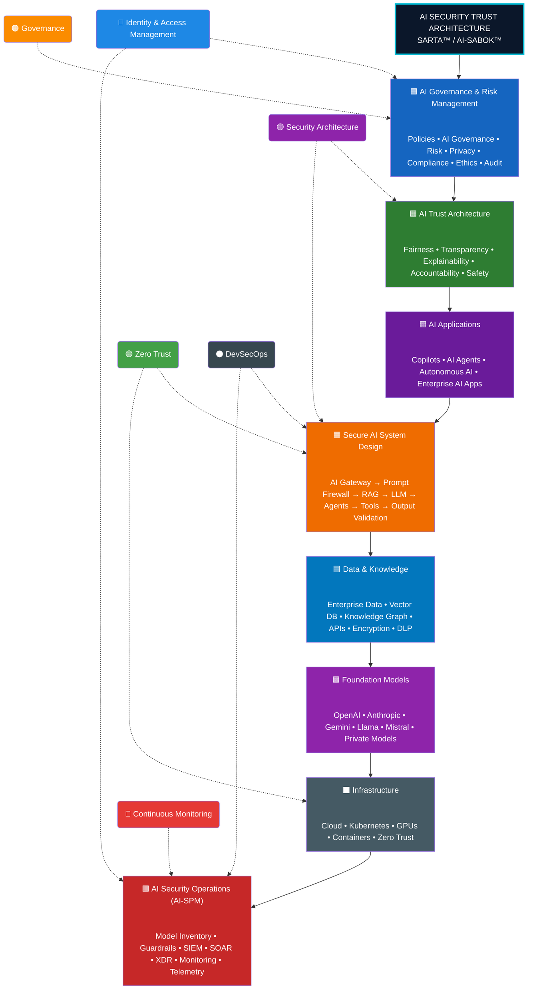

### Design Principles

The architecture is built on six core principles:

1. **Secure by Design**
2. **Trust by Default**
3. **Zero Trust Everywhere**
4. **Govern Throughout the AI Lifecycle**
5. **Monitor Continuously**
6. **Improve Through Measured Risk**

---

### SARTA™ Sovereignty includes the ability to understand:

***a) Where do technology and data reside?***

***b) Who controls them?***

***c) Who can access them?***

***d) Which dependencies exist?***

***e) Which external parties have influence or access?***

***f) What legal, regulatory, and contractual obligations apply?***

***g) What happens if a critical provider, platform, or dependency becomes unavailable?***

---

## ADAPTIVE

**Adaptive represents the ability of security and governance capabilities to change as threats, technology, missions, architectures, regulations, and organizational risk change.**

***SARTA™ therefore treats cybersecurity and AI security as continuous processes instead of one-time compliance exercises.***

**Adaptive capabilities include:**

1. ***Continuous Risk Assessment***
2. ***Continuous Monitoring***
3. ***Threat-Informed Defense***
4. ***Dynamic Access Decisions***
5. ***Security Telemetry***
6. ***AI Behavioral Monitoring***
7. ***Changing Security Controls as Risk Changes***
8. ***Continuous Improvement***
9. ***Lessons Learned***
10. ***Emerging-Technology Assessment***

---

## RESILIENCE

**Resilience represents the organization's ability to anticipate, withstand, respond to, recover from, and adapt to disruptive cybersecurity, technology, AI, operational, and supply-chain events.**

***SARTA™ resilience encompasses:***

a) **Cyber Resilience**

b) **Cloud Resilience**

c) **AI Resilience**

d) **Operational Resilience**

e) **Data Resilience**

f) **Identity Resilience**

g) **Supply-Chain Resilience**

h) **Disaster Recovery**

i) **Business Continuity**

j) **Incident Response**

k) **Recovery and Restoration**

l) **Adaptive Improvement**

***The objective is not merely to prevent compromise. The objective is to ensure that the organization can continue operating, respond effectively, and recover when prevention fails.***

---

## TRUST

**Trust represents confidence that technology, identities, data, systems, applications, AI models, AI agents, and transactions are appropriately authorized, protected, observable, and governed.**

***SARTA™ treats trust as earned, evaluated, and continuously reassessed instead of permanently assumed.***

### Trust is influenced by:

1. **Identity**
2. **Authentication**
3. **Authorization**
4. **Device/Workload Posture**
5. **Data Sensitivity**
6. **Transaction Context**
7. **Behavioral Signals**
8. **Threat Intelligence**
9. **Security Telemetry**
10. **Policy**
11. **Risk**
12. **Human Oversight**
13. **AI Behavior**

***SARTA™ therefore aligns naturally with Zero Trust principles while remaining an ADUROM AI proprietary methodology.***

---

## AI-SABOK™ AI Security Architect Body of Knowledge™

**Defines the core domains, principles, and best practices required to design, build, secure, deploy, monitor, and govern trustworthy AI solutions throughout their lifecycle.**

***Together, these frameworks provide a structured approach for implementing:***

* 🛡️ AI Governance & Risk Management (aligned with the NIST AI RMF)
* 🤝 AI Trust Architecture
* 🏗️ Secure AI System Design (RAG, Agents, AI Gateways)
* 🔍 AI Threat Modeling & Risk Analysis
* 🔐 AI Identity & Access Management
* 📊 AI Security Posture Management (AI-SPM)
* 🚀 Continuous Monitoring & Operational Resilience

**👤 Created by ADUROM AI**

**Sole Owner of (SARTA™ / AI-SABOK™ / AITORA™ / SARTA™v3™)**

**Copyright© June 1, 2026 by ADUROM AI (All Rights Reserved)**

**Version 1.0**

***Mission Statement:
To establish the definitive, vendor-neutral body of knowledge for AI Security Architects by integrating enterprise architecture, cybersecurity, identity, governance, cloud platforms, AI engineering concepts, and operational best practices into a single, practical reference.***

---

### Architecture Layers

| Layers                                  | Purpose                                                                              |
| -------------------------------------- | ------------------------------------------------------------------------------------ |
| 🟦 **Governance & Risk Management**    | Policies, compliance, ethics, privacy, and enterprise AI governance                  |
| 🟩 **AI Trust Architecture**           | Fairness, transparency, explainability, accountability, safety, and resilience       |
| 🟪 **AI Applications**                 | Copilots, AI assistants, autonomous AI, and enterprise AI applications               |
| 🟧 **Secure AI System Design**         | AI Gateways, Prompt Firewalls, RAG, Agents, MCP, and output validation               |
| 🟦 **Data & Knowledge**                | Enterprise data, vector databases, knowledge graphs, APIs, encryption, and DLP       |
| 🟪 **Foundation Models**               | Public and private LLMs, foundation models, and fine-tuned models                    |
| ⬛ **Infrastructure**                   | Cloud, Kubernetes, GPUs, containers, networking, and Zero Trust                      |
| 🟥 **AI Security Operations (AI-SPM)** | Guardrails, monitoring, telemetry, SIEM, SOAR, XDR, posture management, and auditing |

---

### Cross-Cutting Security Pillars

These capabilities apply across **every layer** of the architecture:

* 🔵 **Identity & Access Management**
* 🟢 **Zero Trust**
* 🟣 **Security Architecture**
* 🟠 **Governance**
* 🔴 **Continuous Monitoring**
* ⚫ **DevSecOps**

---

### 🎯 Core Objectives

* 🧠 Advance research into autonomous security systems
* ☁️ Define sovereign Zero Trust cloud architectures
* 🔐 Model compliance as a continuous computational process
* 🤖 Explore AI-assisted security governance
* 🧩 Demonstrate systems architecture & security engineering at research level

---

### Engineering Domains

* Autonomous Security Systems
* Zero Trust Architecture (Zero Trust Security)
* AI Governance
* Digital Sovereignty
* Cloud Security Engineering
* Distributed Trust Systems
* Continuous Compliance Automation
* Operational Resilience Engineering

---

## ⚙️ Key Capabilities

### 🧠 1. Runtime Intelligence Layer (Sensing & Perception)

### 👁️ Runtime Intelligence

* Kernel-level telemetry
* Behavioral anomaly detection
* Container activity monitoring
* Live attack surface mapping

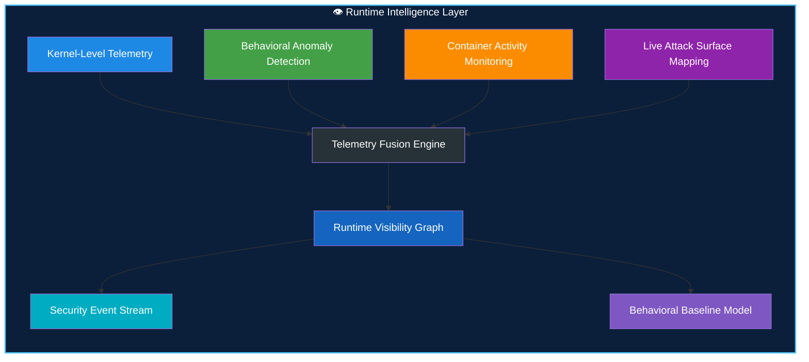

---

### 🛡️ 2. Zero Trust Enforcement Layer (Continuous Verification)

### 🔐 Zero Trust Enforcement

* Continuous workload identity validation
* Mutual authentication
* Policy-driven authorization
* Real-time trust scoring

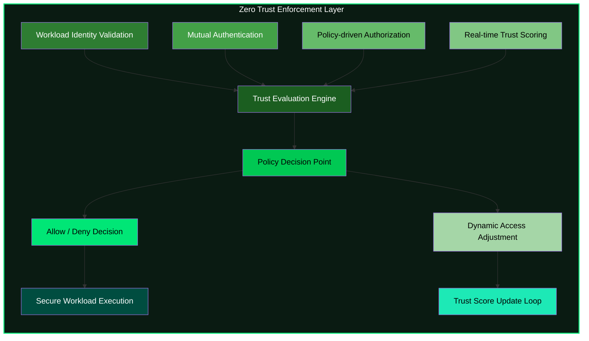

---

### ⚡ 3. Autonomous Response System (Digital Reflex Layer)

### Autonomous Response

* Namespace isolation
* Pod termination
* Traffic throttling
* Node quarantine
* Dynamic policy updates

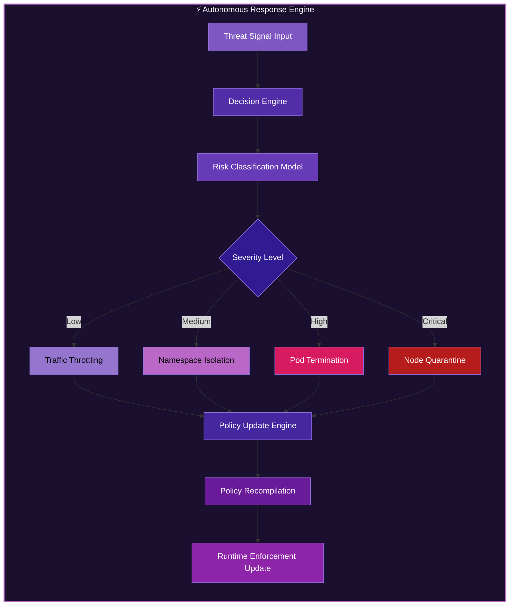

---

### 🌍 4. Sovereign Federation Layer (Distributed Trust System)

### Sovereign Federation

* Cross-domain intelligence sharing
* Regional policy autonomy
* Data locality enforcement
* Federated trust propagation

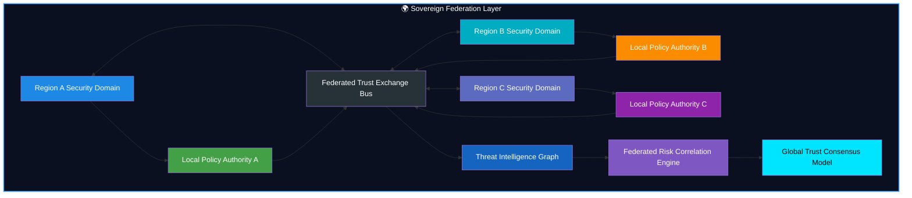

---

### 🧬 Executive Summary

SARTA operationalizes:

* AI-assisted security governance
* Runtime Zero Trust enforcement
* Sovereign multi-cloud control planes
* Federated threat intelligence
* Autonomous incident response
* Policy-as-code enforcement
* Continuous compliance verification
* Digital sovereignty controls

---

### ✨ Master Architecture View (All Layers Combined)

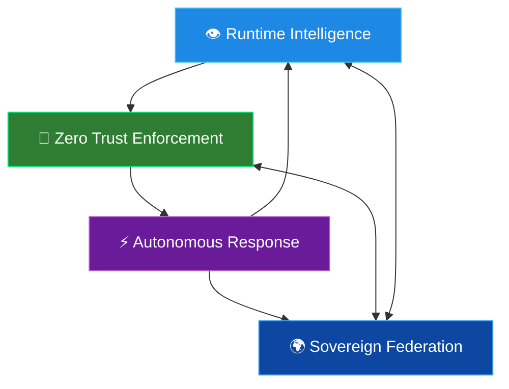

---

## ❓ Why SARTA Exists

Modern security ecosystems are fragmented across:

* SIEM systems
* Identity providers
* Runtime security tools
* Compliance frameworks
* Incident response workflows

### ⚠️ Resulting Problems

* Delayed detection
* Slow response cycles
* Policy inconsistency
* High operational overhead
* Fragmented visibility

SARTA explores whether these can be unified into a **single adaptive computational system**.

---

### 🧪 Research Motivation

Modern infrastructure spans:

* Multi-cloud environments
* Sovereign jurisdictions
* Distributed trust boundaries

Traditional security models remain static and human-driven.

SARTA investigates:

> Can security become a **self-regulating computational organism**?

---

### 🔬 Research Questions

* Can Zero Trust adapt continuously using runtime learning?
* Can compliance become executable code instead of documentation?
* Can sovereign systems share intelligence without losing autonomy?
* What governance is required for AI-driven security decisions?
* Can resilience be continuously verified at runtime?

---

### 🧭 Core Thesis

Security systems should evolve into **digital immune systems**:

* Continuous sensing
* Context-aware reasoning
* Autonomous response
* Policy evolution
* Federated intelligence
* Self-healing behavior

---

### 🧱 Design Principles

* Identity before network trust
* Runtime visibility over assumptions
* Policy as executable logic
* Autonomous response by default
* Human oversight always available
* Sovereignty preserved across domains
* Continuous verification over audits
* Compliance as a runtime property

---

## AITORA™ AI Trust & Operational Readiness Assessment™

**The Market Position:
AITORA™ provides enterprises with a comprehensive, framework-aligned assessment to determine whether AI systems are secure, governed, resilient, and operationally ready for trusted deployment.**

**👤 Created by ADUROM AI**

**Sole Owner of (SARTA™ / AI-SABOK™ / AITORA™ / SARTA™v3™)**

**Copyright© June 1, 2026 by ADUROM AI (All Rights Reserved)**

**Version 1.0**

---

### 🤖 AITORA™ SECURITY ASSESSMENT MODEL

***AI Security represents the protection of AI models, AI applications, AI infrastructure, AI data, AI agents, AI interfaces, AI tools and AI-enabled workflows against security threats and unintended behavior.***

**AITORA™ AI Security Threat Assessments - Address:**

1. AI Threat Modeling
2. Prompt injection
3. Data Leakage
4. Model and Application Security
5. RAG Security
6. AI API Security
7. AI Identity
8. AI Authorization
9. AI Agent Security
10. Tool-Use Security
11. AI Supply-Chain Security
12. AI Monitoring
13. AI Telemetry
14. AI Guardrails
15. Output Validation
16. AI Incident Response
17. AI Resilience

***AI Governance represents the organizational policies, accountability structures, risk-management processes and oversight mechanisms used to govern the responsible, secure and controlled use of AI.***

**AITORA™ AI Security Governance Assessments - Address:**

1. AI Inventory
2. AI Ownership
3. AI Risk Classification
4. Acceptable Use
5. Human Oversight
6. Data Governance
7. Data Privacy
8. Enterprise Security
9. AI Training Model Governance
10. Vendor Governance
11. AI Lifecycle Management
12. Continuous Monitoring
13. Incident Management
14. Accountability
15. Regulatory and Policy Obligations

### Allowed Actions

* Risk scoring
* Threat classification
* Remediation suggestions
* Policy recommendations

### Forbidden Actions

* Overriding trust roots
* Disabling security controls
* Bypassing policy enforcement
* Autonomous identity modification

> All AI actions remain **policy-bound and human-governed**.

---

## 🧬 Digital Immune System Model

<div align="center">


</div>

---

### 🌐 Biological-to-Digital Mapping

| 🧬 Biological System | 🛡️ SARTA Equivalent   | 🎯 Function                                      |
| -------------------- | ---------------------- | ------------------------------------------------ |
| ⚪ White Blood Cells  | Runtime Sensors        | Detect threats and anomalies in real time        |
| 🧠 Brain             | AI Risk Engine         | Analyze, correlate, and prioritize risks         |
| 🧪 Antibodies        | Policy System          | Prevent and neutralize malicious actions         |
| ⚡ Reflex System      | Response Engine        | Execute automated containment and remediation    |
| 🧠💾 Immune Memory   | Threat Knowledge Graph | Learn from previous attacks and improve defenses |

---

### 🧬 Digital Immune Response Cycle

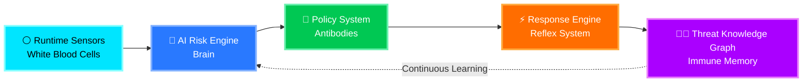

---

### 🩺 Immune System Health Indicators

| Capability               | Status    |
| ------------------------ | --------- |
| 🔍 Threat Detection      | 🟢 Active |
| 🧠 Risk Intelligence     | 🟢 Active |
| 🛡️ Policy Enforcement   | 🟢 Active |
| ⚡ Automated Response     | 🟢 Active |
| 📚 Threat Learning       | 🟢 Active |
| 🔄 Continuous Adaptation | 🟢 Active |

---

## 🎨 Defense Maturity Overview

```text
⚪ Runtime Sensors          🟢🟢🟢🟢🟢 🟢🟢🟢🟢🟢
🧠 AI Risk Engine          🟢🟢🟢🟢🟢 🟢🟢🟢🟢🟢
🧪 Policy System           🟢🟢🟢🟢🟢 🟢🟢🟢🟢🟢
⚡ Response Engine         🟢🟢🟢🟢🟢 🟢🟢🟢🟢⚪
🧠💾 Threat Knowledge      🟢🟢🟢🟢🟢 🟢🟢🟢🟢🟢
```

---

> [!TIP]
> Just as the human immune system continuously detects, analyzes, responds, and learns from biological threats, the **SARTA Digital Immune System** continuously monitors workloads, evaluates risk, enforces policy, orchestrates automated responses, and builds institutional memory from every security event.


## 🧪 Threat Model

### ✅ Defended Against

* Privilege escalation
* Credential misuse
* Lateral movement
* Supply chain compromise
* Policy drift
* Insider threats

### ⚠️ Partially Addressed

* Advanced persistent threats
* Multi-stage intrusion campaigns
* Federated trust abuse

### 🚫 Out of Scope

* Hardware implants
* Firmware-level attacks
* Physical infrastructure compromise

---

## 🧠 Core Idea: Autonomous Security Mesh (v3)

SARTA introduces a shift from fragmented tooling to a unified **Autonomous Security Mesh**:

**👤 Created by ADUROM AI**

**Sole Owner of (SARTA™ / AI-SABOK™ / AITORA™ / SARTA™v3™)**

**Copyright© June 1, 2026 by ADUROM AI (All Rights Reserved)**

**Version 1.0**

***SARTA™ incorporates emerging AI-security concepts including:***

* AI Security
* AI Governance
* AI-IAM — AI Identity & Access Management
* AI-SPM — AI Security Posture Management
* Agentic AI Security
* RAG Security
* AI Guardrails
* AI Telemetry
* AI Supply-Chain Security
* AI Threat Modeling
* AI Security Assurance

***Important Disclaimer: These relationships represent ADUROM AI's methodology for organizing and applying applicable requirements. They should not be interpreted as official government endorsement or official crosswalks unless specifically identified as such.***

---

### 🚀 Autonomous Cyber Defense Architecture

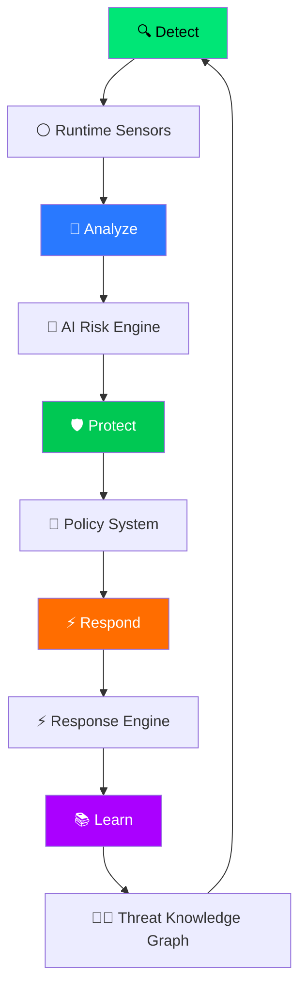

---

### AI-IAM

***AI-IAM — Artificial Intelligence Identity & Access Management — represents the identity, authentication, authorization and privilege-management capabilities required to securely control access by and to AI systems.***

**AI-IAM applies identity principles to:**

* AI applications
* AI models
* AI agents
* AI tools
* AI services
* Machine identities
* Service identities
* Human-to-AI interactions
* Agent-to-agent interactions
* Agent-to-tool interactions
* Agent-to-data interactions

**SARTA™ AI-IAM emphasizes:**

***Identity → Authentication → Authorization → Least Privilege → Context → Monitoring → Revocation. The objective is to ensure that an AI system or agent has only the access necessary to perform its authorized function. AI-IAM is an ADUROM AI conceptual/service domain and is not represented as an official government standard.***

---

### AI-SPM

***AI-SPM — Artificial Intelligence Security Posture Management — represents the continuous identification, assessment, monitoring and improvement of an organization's AI-security posture.***

**SARTA™ AI-SPM may include:**

* AI asset discovery
* AI inventory
* Model inventory
* Agent inventory
* AI application inventory
* AI dependency discovery
* AI configuration assessment
* AI vulnerability identification
* AI risk scoring
* AI policy compliance
* AI data exposure
* AI identity exposure
* AI supply-chain exposure
* AI telemetry
* Continuous monitoring
* Remediation tracking

***AI-SPM is an ADUROM AI conceptual/service domain rather than a government-approved framework or certification.***

---

### AI AGENT SECURITY

***AI Agent Security represents the security of AI systems capable of independently executing tasks, invoking tools, accessing data, interacting with applications, or taking authorized actions.***

**SARTA™ evaluates:**

* Agent identity
* Agent permissions
* Tool permissions
* Data permissions
* API permissions
* Agent-to-agent communication
* Human approval
* Autonomous actions
* Transaction boundaries
* Prompt and instruction security
* Output validation
* Monitoring
* Logging
* Containment
* Emergency disablement

**The central SARTA™ question is:**

***What can the agent see, access, execute, modify, and communicate—and what happens when its behavior becomes unsafe or compromised?***

---

### AI GUARDRAILS

***AI Guardrails represent preventive, detective, and corrective mechanisms designed to constrain AI behavior within authorized security, policy, safety, and operational boundaries.***

**Guardrails may include:**

* Input validation
* Prompt controls
* Content controls
* Data-loss prevention
* Access controls
* Tool restrictions
* Output validation
* Human approval
* Transaction limits
* Policy enforcement
* Monitoring
* Automated containment

***Guardrails are treated as one layer of a broader defense-in-depth architecture and are not assumed to provide complete security by themselves.***

---

### AI TELEMETRY

***AI Telemetry represents the collection and analysis of security-relevant information generated by AI systems and their surrounding infrastructure.***

**Telemetry may include:**

* Prompts
* Responses
* Model activity
* User identity
* Agent identity
* Tool calls
* API calls
* Data access
* Security events
* Policy violations
* Behavioral anomalies
* Configuration changes
* Authentication events

***Telemetry supports monitoring, investigation, detection, assurance, and incident response.***

---

### ASSURANCE

***Assurance represents evidence-based confidence that security, governance, risk and control objectives are appropriately designed, implemented, operating and monitored.***

**SARTA™ assurance includes:**

* Security assessments
* Control assessments
* Evidence validation
* Architecture reviews
* Risk assessments
* Independent verification
* Continuous monitoring
* Remediation validation
* Executive reporting

**Assurance asks:**

***How do we know the organization is actually protected, rather than merely claiming compliance?***

---

### SECURITY CONTROLS

***Control represents a safeguard, process, technology, policy or organizational mechanism designed to reduce risk.***

**SARTA™ recognizes:**

* Preventive controls
* Detective controls
* Corrective controls
* Administrative controls
* Technical controls
* Physical controls
* Compensating controls
* AI-specific controls

***Controls should be evaluated for both design effectiveness and operating effectiveness, where applicable.***

---

### EVIDENCE

***Evidence represents objective information demonstrating the design, implementation, operation or effectiveness of a security, governance or risk-management capability.***

**Examples include:**

* Policies
* Procedures
* Configurations
* Logs
* Tickets
* System documentation
* Architecture diagrams
* Access records
* Assessment results
* Monitoring records
* Test results
* Interviews
* Technical artifacts

***SARTA™ emphasizes evidence-based assessment rather than documentation-only compliance.***

---

### CONTINUOUS MONITORING

***Continuous Monitoring represents the ongoing observation, analysis, and reassessment of security, technology, AI, and risk conditions.***

**It may include:**

* Security telemetry
* Vulnerability monitoring
* Configuration monitoring
* Identity monitoring
* Cloud monitoring
* AI monitoring
* Threat intelligence
* Control monitoring
* Risk reassessment
* Remediation tracking

---

### 🔄 Continuous Security Loop

```mermaid
flowchart LR

%% =========================
%% CORE LOOP
%% =========================

A[Runtime Telemetry<br/>Kernel + Workload Signals] --> 
B[Risk Engine<br/>Behavioral + Threat Scoring]

B --> 
C[Policy Decision Layer<br/>Policy-as-Code Evaluation]

C --> 
D[Autonomous Response Engine<br/>Mitigation & Containment]

D --> 
E[Identity & Trust Re-evaluation<br/>Continuous Verification]

E --> 
F[Federated Intelligence Sharing<br/>Cross-Domain Threat Learning]

F --> 
B

%% =========================
%% VISUAL STYLING
%% =========================

classDef telemetry fill:#1e88e5,color:#ffffff,stroke:#90caf9,stroke-width:1px;
classDef risk fill:#6a1b9a,color:#ffffff,stroke:#ce93d8,stroke-width:1px;
classDef policy fill:#2e7d32,color:#ffffff,stroke:#a5d6a7,stroke-width:1px;
classDef response fill:#d32f2f,color:#ffffff,stroke:#ef9a9a,stroke-width:1px;
classDef identity fill:#00897b,color:#ffffff,stroke:#80cbc4,stroke-width:1px;
classDef federation fill:#1565c0,color:#ffffff,stroke:#64b5f6,stroke-width:1px;

class A telemetry;
class B risk;
class C policy;
class D response;
class E identity;
class F federation;

%% =========================
%% FLOW EMPHASIS
%% =========================

linkStyle default stroke:#90a4ae,stroke-width:2px;
```

---


## 🏗️ System Architecture (v3 Autonomous Mesh)

### 🧩 Layered Model

* Identity Layer
* Policy Engine
* Runtime Security Layer
* Autonomy Engine
* Threat Graph
* Observability Layer
* Federation Layer

---

### 🧠 Technology Stack

<div align="center">


</div>

---

### 🏗️ Platform Architecture

| 🏢 Layer | 🚀 Technologies | 🎯 Purpose |
|----------|----------------|------------|
| ⚙️ Runtime | Kubernetes • eBPF • Falco | Secure cloud-native workload execution |
| 🔐 Identity | SPIFFE • SPIRE | Zero Trust workload identity |
| 📜 Policy | Open Policy Agent (OPA) • Gatekeeper | Policy-as-Code & governance |
| 📊 Observability | OpenTelemetry • Prometheus | Monitoring, telemetry & visibility |
| 🤖 Intelligence | AI Risk Scoring Engine | Threat prediction & risk analysis |
| 🛡️ Compliance | Continuous Verification System | Automated compliance assurance |

---

### 📐 Security Architecture

<div align="center">


</div>

---

### 🏗️ Layered Security Platform

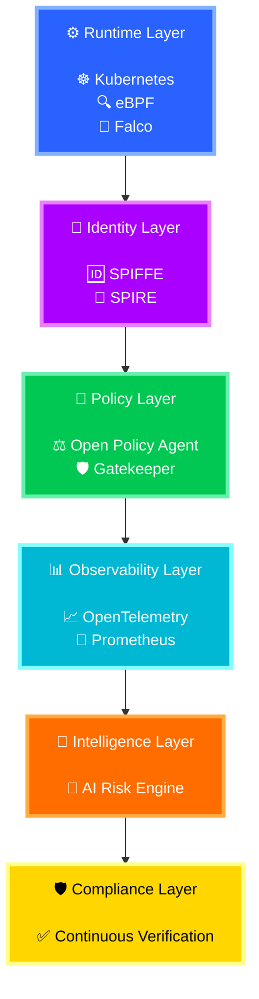

---

### 🌈 Capability Flow

```text
⚙️ Runtime Security
        │
        ▼
🔐 Zero Trust Identity
        │
        ▼
📜 Policy Enforcement
        │
        ▼
📊 Telemetry & Visibility
        │
        ▼
🤖 AI Risk Intelligence
        │
        ▼
🛡️ Continuous Compliance
```

---

### 🎯 Security Capability Matrix

| Layer            | Mission                   | Status    |
| ---------------- | ------------------------- | --------- |
| ⚙️ Runtime       | Workload Protection       | 🟢 Active |
| 🔐 Identity      | Zero Trust Authentication | 🟢 Active |
| 📜 Policy        | Governance & Enforcement  | 🟢 Active |
| 📊 Observability | Telemetry & Monitoring    | 🟢 Active |
| 🤖 Intelligence  | AI Risk Analysis          | 🟢 Active |
| 🛡️ Compliance   | Continuous Assurance      | 🟢 Active |

---

### 🚀 Security Operating Model


> [!IMPORTANT]
> This architecture implements a **Zero Trust, AI-Driven Digital Immune System** where every workload is authenticated, every action is authorized, every event is observed, every risk is analyzed, and every control is continuously verified for compliance.

---

### 🎯 Capability Mapping

| Capability | Status |
|------------|---------|
| 🔐 Zero Trust Identity | 🟢 Enabled |
| ☁️ Cloud Native Security | 🟢 Enabled |
| 📜 Policy as Code | 🟢 Enabled |
| 📊 Real-Time Monitoring | 🟢 Enabled |
| 🤖 AI-Powered Risk Analysis | 🟢 Enabled |
| 🛡️ Continuous Compliance | 🟢 Enabled |
| 🚨 Threat Detection | 🟢 Enabled |
| 🔍 Audit Readiness | 🟢 Enabled |

---

> [!TIP]
> This architecture combines **Zero Trust**, **Cloud Native Security**, **Policy-as-Code**, **Observability**, **AI-Driven Risk Analytics**, and **Continuous Compliance** into a unified security platform.


## 🌐 Global Cybersecurity Framework Alignment Matrix


### 🛡️ Global Crosswalk of Cybersecurity, Privacy, Resilience, and Compliance Frameworks

</div>

---

## 📌 Alignment Legend

| Rating | Meaning |
|----------|----------|
| 🟣 Very High | Directly aligned |
| 🟢 High | Strong alignment |
| 🟡 Medium | Partial alignment |
| 🔴 Low | Limited alignment |

---

## 🇺🇸 United States

---

## 🔵 NIST Cybersecurity Framework (CSF) 2.0


### Alignment Matrix

| Standard | Alignment |
|-----------|------------|
| NIST SP 800-207 | 🟢 High |
| ISO 27001 | 🟢 High |
| GDPR | 🟡 Medium |
| DORA | 🟢 High |
| NIS2 | 🟢 High |
| PCI DSS | 🟡 Medium |

### Key Areas

- 🏛️ Governance
- 🎯 Risk Management
- 🔐 Identity & Access Management
- 🚨 Incident Response
- 🔗 Supply Chain Security
- 📈 Continuous Monitoring

---

## 🔷 NIST SP 800-53 Rev.5

> [!TIP]
> Considered one of the most comprehensive security control catalogs globally.

### Alignment Matrix

| Standard | Alignment |
|-----------|------------|
| NIST SP 800-207 | 🟢 High |
| ISO 27001 | 🟢 High |
| GDPR | 🟢 High |
| DORA | 🟢 High |
| NIS2 | 🟢 High |
| PCI DSS | 🟢 High |

### Key Areas

- 🔒 Access Control
- 📝 Audit Logging
- 🔑 Encryption
- 👤 Privacy Controls
- ♻️ Resilience & Recovery
- 📡 Security Monitoring

---

## 🟦 CISA Zero Trust Maturity Model

### Alignment Matrix

| Standard | Alignment |
|-----------|------------|
| NIST SP 800-207 | 🟣 Very High |
| ISO 27001 | 🟡 Medium |
| GDPR | 🔴 Low |
| DORA | 🟡 Medium |
| NIS2 | 🟡 Medium |
| PCI DSS | 🔴 Low |

### Domains

- 👤 Identity
- 💻 Devices
- 🌐 Networks
- 📦 Applications
- 📁 Data
- 📊 Analytics
- 🤖 Automation

---

## ☁️ FedRAMP

### Focus

- ☁️ Cloud Security
- 📈 Continuous Monitoring
- 🏛️ Authorization Management
- 🎯 Risk Assessment

---

## 🇨🇦 Canada

<details>
<summary><b>🟥 ITSG-33</b></summary>

### Alignment Matrix

| Standard | Alignment |
|-----------|------------|
| NIST SP 800-207 | 🟢 High |
| ISO 27001 | 🟢 High |
| GDPR | 🟡 Medium |
| DORA | 🟡 Medium |
| NIS2 | 🟡 Medium |
| PCI DSS | 🟡 Medium |

### Focus Areas

- 🔐 Security Controls
- 🎯 Risk Management
- 🔄 Continuous Authorization
- 🏛️ Government Baselines

</details>

<details>
<summary><b>🟥 Protected B Cloud Profile</b></summary>

### Focus Areas

- ☁️ Cloud Security
- 🏛️ Government Workloads
- 📂 Data Classification
- 🔐 Secure Operations

</details>

<details>
<summary><b>🟥 PIPEDA</b></summary>

### Focus Areas

- 👤 Privacy Management
- 🔒 Data Protection
- ✅ Consent Management
- 🚨 Breach Notification

</details>

---

## 🇪🇺 European Union

## 🟦 EUCS


### Focus Areas

- ☁️ Cloud Assurance
- 🏆 Security Certification
- 🎯 Risk Management

---

## 🟨 eIDAS 2.0

### Focus Areas

- 🆔 Digital Identity
- 🔑 Strong Authentication
- 🤝 Trust Services

---

## 🟪 EBA ICT Guidelines

> [!IMPORTANT]
> One of the strongest operational resilience frameworks influencing DORA implementation.

### Focus Areas

- 📡 ICT Risk Management
- 🔗 Outsourcing Risk
- ♻️ Operational Resilience

---

## 🟦 ENISA Cybersecurity Guidance

### Strengths

| Area | Rating |
|--------|---------|
| NIS2 | 🟣 Very High |
| DORA | 🟢 High |
| ISO 27001 | 🟢 High |

---

## 🇬🇧 United Kingdom

## 🔷 NCSC Cyber Assessment Framework (CAF)

### Security Outcomes

- 🎯 Risk Management
- 🛡️ Asset Protection
- 🔎 Detection
- 🚨 Response
- ♻️ Recovery

---

## 🟢 Cyber Essentials Plus

### Core Controls

- 🔑 Multi-Factor Authentication
- 🔄 Patch Management
- ⚙️ Secure Configuration
- 🦠 Malware Protection

---

## 🔵 UK GDPR

### Primary Focus

- 👤 Data Privacy
- 🔒 Personal Data Protection
- 📜 Regulatory Compliance

---

## 🌍 Middle East

## 🇦🇪 United Arab Emirates

### 🌟 UAE Information Assurance Standards (IAS)

<div align="center">


</div>

| Security Domain         | Maturity              |
| ----------------------- | --------------------- |
| 🟦 Security Governance  | 🟢🟢🟢🟢🟢 🟢🟢🟢🟢🟢 |
| 🟪 Risk Management      | 🟢🟢🟢🟢🟢 🟢🟢🟢🟢🟢 |
| 🟨 Compliance           | 🟢🟢🟢🟢🟢 🟢🟢🟢🟢⚪  |
| 🟥 Operational Security | 🟢🟢🟢🟢🟢 🟢🟢🟢🟢🟢 |

---

### UAE PDPL

- 👤 Privacy Protection
- 🔐 Data Governance
- 🌐 Cross-Border Data Controls

---

## 🇸🇦 Saudi Arabia

### Essential Cybersecurity Controls (ECC)


Key Areas:

- 🔐 Cybersecurity Governance
- 🎯 Risk Management
- 🏢 Organizational Security
- 📡 Operational Security

---

### Cloud Cybersecurity Controls (CCC)

- ☁️ Cloud Security
- 🔒 Data Protection
- 🔑 Identity Management
- 🛡️ Zero Trust Principles

---

## 🌏 Asia-Pacific

## 🇸🇬 Singapore

### Critical Information Infrastructure Code

| Domain | Rating |
|----------|----------|
| DORA Alignment | 🟢 High |
| NIS2 Alignment | 🟢 High |
| ISO 27001 Alignment | 🟢 High |

---

## 🇯🇵 Japan

### Cybersecurity Management Guidelines

- 🏛️ Governance
- 🎯 Risk Management
- 🔐 Security Controls
- 📈 Continuous Improvement

---

## 🇦🇺 Australia

### 🚀 Essential Eight

<div align="center">


</div>

| Security Control                | Maturity              |
| ------------------------------- | --------------------- |
| 🟦 Application Control          | 🟢🟢🟢🟢🟢 🟢🟢🟢🟢🟢 |
| 🟪 Patch Applications           | 🟢🟢🟢🟢🟢 🟢🟢🟢🟢🟢 |
| 🟨 Multi-Factor Authentication  | 🟢🟢🟢🟢🟢 🟢🟢🟢🟢🟢 |
| 🟥 Privileged Access Management | 🟢🟢🟢🟢🟢 🟢🟢🟢🟢⚪  |
| 🟩 Backup & Recovery            | 🟢🟢🟢🟢🟢 🟢🟢🟢🟢🟢 |

---

## 📊 Global Alignment Summary

| Framework | Zero Trust | ISO 27001 | GDPR | DORA | NIS2 | PCI DSS |
|------------|------------|------------|------------|------------|------------|------------|
| NIST CSF 2.0 | 🟢 | 🟢 | 🟡 | 🟢 | 🟢 | 🟡 |
| NIST SP 800-53 | 🟢 | 🟢 | 🟢 | 🟢 | 🟢 | 🟢 |
| CISA ZTMM | 🟣 | 🟡 | 🔴 | 🟡 | 🟡 | 🔴 |
| ITSG-33 | 🟢 | 🟢 | 🟡 | 🟡 | 🟡 | 🟡 |
| UK CAF | 🟡 | 🟢 | 🟡 | 🟢 | 🟢 | 🟡 |
| Saudi ECC | 🟢 | 🟢 | 🟡 | 🟡 | 🟡 | 🟡 |
| UAE IAS | 🟡 | 🟢 | 🟡 | 🟡 | 🟡 | 🟡 |
| Singapore CII | 🟡 | 🟢 | 🟡 | 🟢 | 🟢 | 🔴 |
| ACSC ISM | 🟢 | 🟢 | 🟡 | 🟡 | 🟡 | 🟡 |
| PCI DSS 4.0 | 🟡 | 🟢 | 🟡 | 🟡 | 🟡 | 🟣 |

---

## 🚀 Recommended Global Baseline Stack

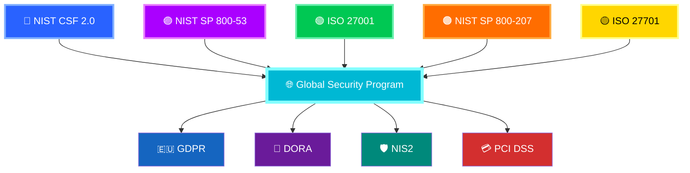

> [!SUCCESS]
> 🛡️ **Global Security Program Foundation**
>
> 🔵 NIST CSF 2.0
> 🟣 NIST SP 800-53
> 🟢 ISO 27001
> 🟡 ISO 27701
> 🟠 NIST SP 800-207 (Zero Trust)
>
> Together, these frameworks provide comprehensive coverage for:
>
> * 🇪🇺 GDPR
> * 🏦 DORA
> * 🛡️ NIS2
> * 💳 PCI DSS 4.0
> * ☁️ Cloud Security
> * 🔐 Zero Trust Architecture
> * 🌍 Global Regulatory Compliance

## 📈 Key Metrics

* Mean Time to Detect (MTTD)
* Mean Time to Respond (MTTR)
* Policy Drift Rate
* False Positive Rate
* Compliance Coverage
* Federation Latency
* Identity Verification Success Rate

---

## ⚔️ Example Attack Response Flow

```text
1. Malicious workload executes
2. Runtime telemetry detects anomaly
3. Risk engine evaluates behavior
4. Policy engine classifies threat
5. Response engine isolates workload
6. Identity trust is recalculated
7. Federation shares intelligence
8. Policies are updated automatically
```

---

## 🧭 Architecture Decision Records (ADR)

Stored in:

```bash
docs/adr/
```

Each ADR documents:

* Context
* Decision
* Alternatives
* Consequences

---

## 🔬 Research Contributions

* Autonomous Security Control Model
* Federated Sovereign Trust Framework
* Continuous Compliance Architecture
* AI Governance for Security Operations
* Digital Immune System Paradigm

---

## 🗺️ Research Roadmap

* Phase 1 — Reference Architecture
* Phase 2 — Prototype Validation
* Phase 3 — Adaptive Policy Systems
* Phase 4 — Sovereign Federation Experiments
* Phase 5 — AI Governance Validation
* Phase 6 — Large-Scale Operational Testing

---

## 🚀 Reproducing the System

### Requirements

* Kubernetes v1.25+
* Linux kernel 5.x+ with eBPF support
* Open Policy Agent
* Falco
* SPIRE

### Deployment

```bash
kubectl apply -f control-plane/manifests/
kubectl apply -f identity-layer/manifests/
helm install falco runtime-security/helm/falco
kubectl apply -f autonomy-engine/manifests/
make demo-run
```

---

## 🤝 Contribution & Governance

* Trunk-based development
* Security-first review process
* Policy change approval workflow
* Architecture review gates
* Severity-based issue triage

---

## 📚 Publications

All research papers and drafts:

```bash
docs/publications/
```

---

## 🧾 Citation

```bibtex
@misc{sarta2026,
  title={Sovereign Adaptive Resilience and Trust Architecture},
  author={Mr. Mehlek Dawveed},
  year={2026},
  version={v3}
}
```

## SARTA™v3™ Sovereign Adaptive Resilience & Trust Architecture™

* ☁️ Sovereign Cloud Workloads
* ⚪ Runtime Intelligence
* 🔐 Zero Trust Identity
* 📜 Policy-as-Code Governance
* 📊 Observability & Threat Graph
* 🧠 AI Risk Intelligence
* ⚡ Autonomous Response
* 🛡️ Continuous Compliance
* 🌍 Sovereign Federation
* 👨‍⚖️ Human Governance

### Detect → Verify → Govern → Observe → Analyze → Respond → Comply → Federate → Learn → Adapt
---


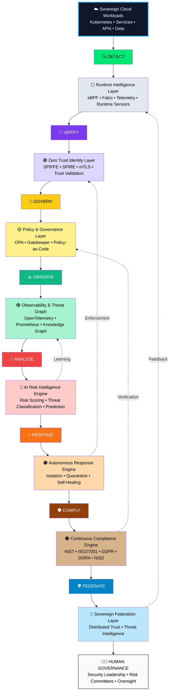

---

## 📜 License

Licensed under the **Apache License 2.0**

---

**Copyright© June 1, 2026 by Creator, Mr. Mehlek Dawveed of the Sovereign Adaptive Resilience & Trust Architecture (SARTA™), AI Security Architect Book of Knowledge (AI-SABOK™), and AI Trust and Operational Readiness Assessment (AITORA™) ALL RIGHTS RESERVED.**


